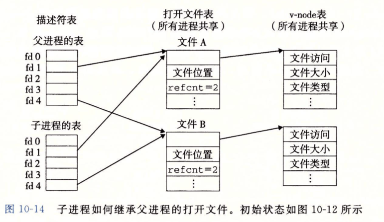
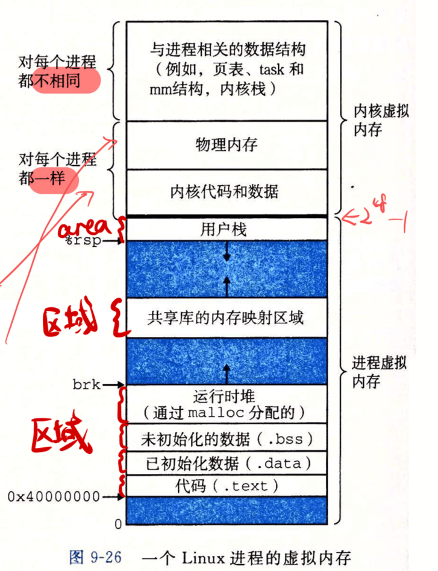
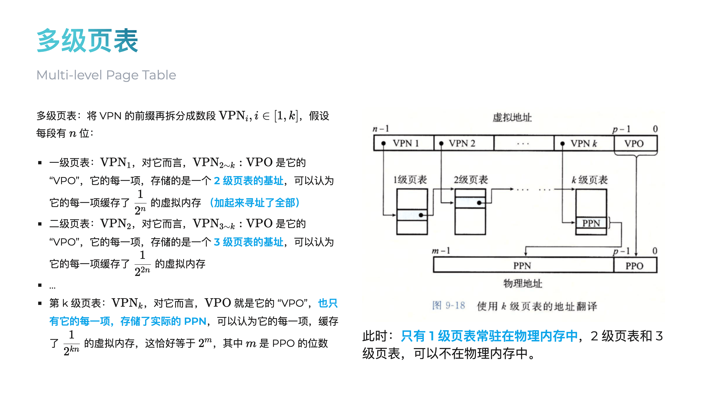
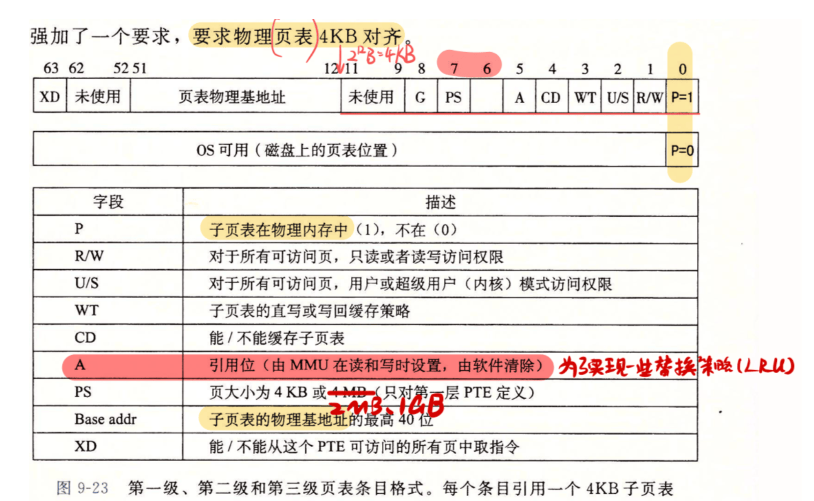
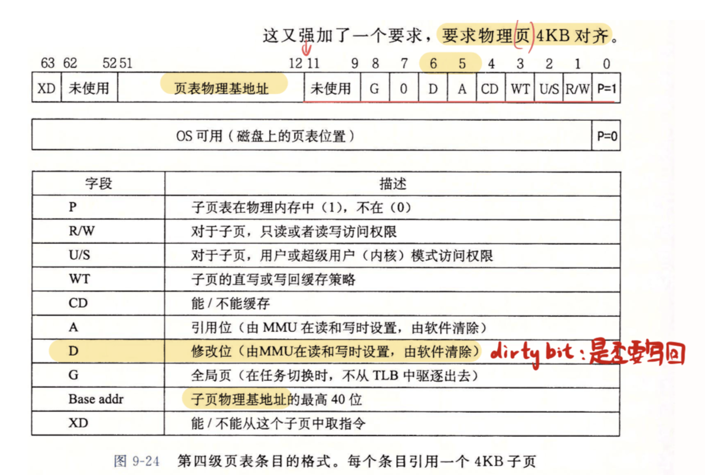
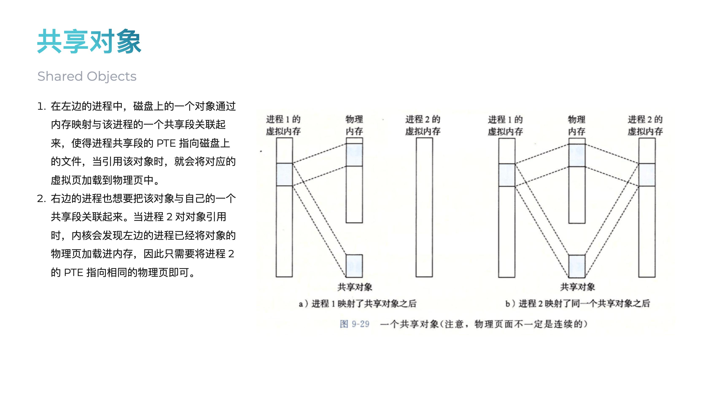
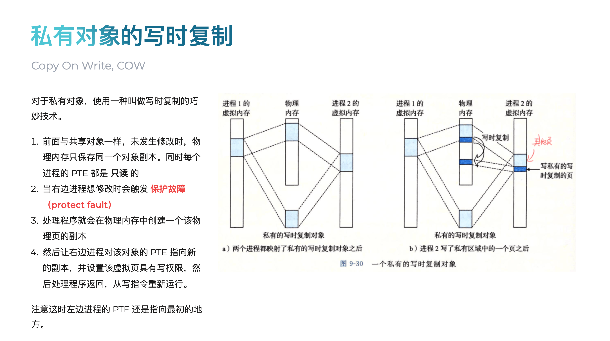
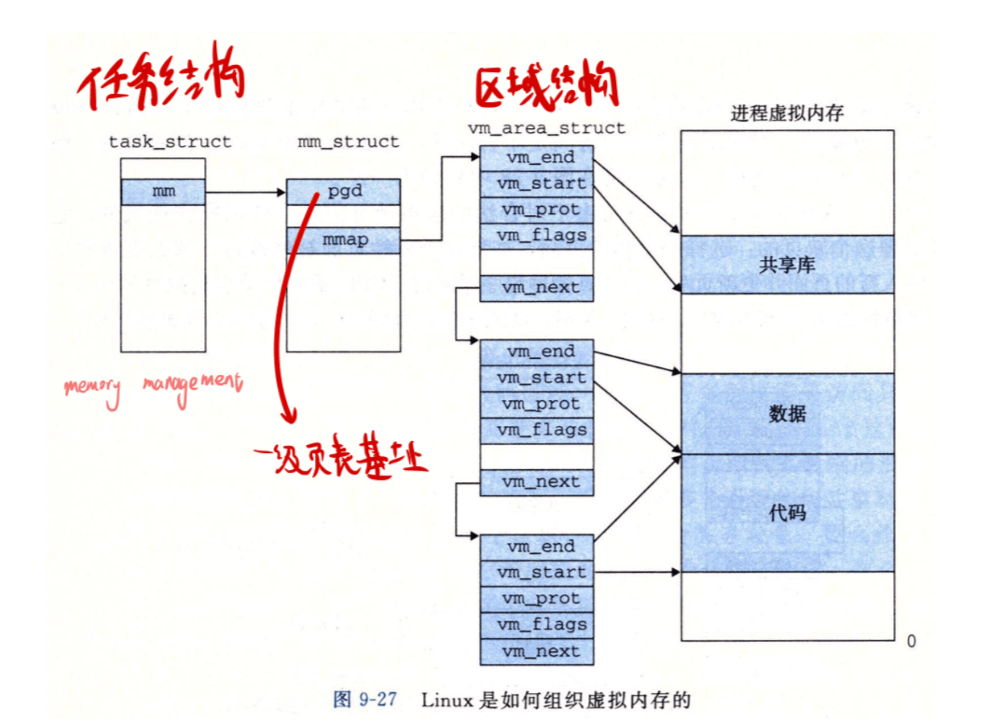

# 更适合北大宝宝体质的 xv6 OS Lab 踩坑记 - Part2

**注意**：此部分在 Part3 之后完成。

本部分包含 3 个测试样例，但是其中 `mmap` 依赖于 `openat` 的实现，而 `open` 测例实际上也同样依赖于 `openat`，所以我们实际上可以在本部分同时完成如下系统调用（按照依赖顺序）：

-   `open`
-   `openat`
-   `brk`
-   `mmap`
-   `munmap`

其中，`brk` 不依赖于 `openat`，所以其实上我在仓库里的最先完成的是 `brk` 系统调用。但为了让行文逻辑更加通顺，我将先进行文件系统相关的讲解与相关系统调用的实现，然后再介绍内存管理相关的系统调用及其实现

## 文件系统

要理解 `openat` 的实现，必须先弄清内核中文件相关的各个数据结构是如何串联起来的。这可能需要阅读如下部分的源码（如果你对 ICS 已经忘的差不多了，也可以回看一下 ICS 第十章系统级 I/O）：

-   `kernel/include/proc.h`
-   `kernel/include/file.h`
-   `kernel/include/fat32.h`

在更早实现的 Part3 中，我们介绍了 **进程控制块（Process Control Block，PCB）** 的概念，简单来讲其就是管理一个进程的核心数据结构。其定义在 `kernel/include/proc.h` 中的 `struct proc`。 它是我们串联起文件系统相关数据的起点。

```c
// Per-process state
struct proc {
  struct spinlock lock;

  // p->lock must be held when using these:
  enum procstate state;        // Process state
  struct proc *parent;         // Parent process
  void *chan;                  // If non-zero, sleeping on chan
  int killed;                  // If non-zero, have been killed
  int xstate;                  // Exit status to be returned to parent's wait
  int pid;                     // Process ID

  // these are private to the process, so p->lock need not be held.
  uint64 kstack;               // Virtual address of kernel stack
  uint64 sz;                   // Size of process memory (bytes)
  pagetable_t pagetable;       // User page table
  pagetable_t kpagetable;      // Kernel page table
  struct trapframe *trapframe; // data page for trampoline.S
  struct context context;      // swtch() here to run process
  struct file *ofile[NOFILE];  // Open files
  struct dirent *cwd;          // Current directory
  char name[16];               // Process name (debugging)
  int tmask;                    // trace mask
};
```

每个进程的 PCB 中都有一个数组 `struct file *ofile[NOFILE];`，这被称为 **进程打开文件表**。当用户程序调用 `open` 或 `openat` 成功后，内核返回一个小的非负整数，这就是 **文件描述符（File Descriptor，fd）**，它本质上就是 `ofile` 数组的索引。

再接着走，我们来到了定义在 `kernel/include/file.h` 中的 `struct file` **打开文件实例**。这个结构体代表了一个被打开的文件在内存中的状态，**它不是文件本身**，而是一个 “句柄”。**它包含了重要的运行时信息**，比如读写权限 (`readable`, `writable`) 和当前的读写偏移量 (`off`)。多个进程打开同一个文件，会得到不同的 `struct file` 实例。

```c
struct file {
  enum { FD_NONE, FD_PIPE, FD_ENTRY, FD_DEVICE } type;
  int ref; // reference count
  char readable;
  char writable;
  struct pipe *pipe; // FD_PIPE
  struct dirent *ep;
  uint off;          // FD_ENTRY
  short major;       // FD_DEVICE
};
```

最后，我们来到了定义在 `kernel/include/fat32.h` 中的 `struct dirent` **目录项 / 索引节点（Directory Entry）**。这个结构体代表了一个文件在磁盘上的 **元数据**，比如文件名、文件大小、属性（是目录还是文件）以及指向数据块的指针等。**所有打开同一个文件的 `struct file` 实例，它们的 `ep` 指针都指向同一个 `struct dirent`。**

```c
struct dirent {
    char  filename[FAT32_MAX_FILENAME + 1];
    uint8   attribute;
    // uint8   create_time_tenth;
    // uint16  create_time;
    // uint16  create_date;
    // uint16  last_access_date;
    uint32  first_clus;
    // uint16  last_write_time;
    // uint16  last_write_date;
    uint32  file_size;

    uint32  cur_clus;
    uint    clus_cnt;

    /* for OS */
    uint8   dev;
    uint8   dirty;
    short   valid;
    int     ref;
    uint32  off;            // offset in the parent dir entry, for writing convenience
    struct dirent *parent;  // because FAT32 doesn't have such thing like inum, use this for cache trick
    struct dirent *next;
    struct dirent *prev;
    struct sleeplock    lock;
};
```

稍微借用一下程设的知识来讲， `file` 和 `dirent` 其实就相当于：

-   `dirent` 就是类的定义，定义了最基本的元数据
-   `file` 就是 `dirent` 这个类的实例，实例化出来之后会加一些别的字段来实现功能，但是不同的实例指向同一个文件（继承同一个类）

$$
\texttt{struct proc} \xrightarrow{\texttt{ofile[fd]}} \texttt{struct file} \xrightarrow{\texttt{ep}} \texttt{struct dirent}
$$

这完全对应 ICS 中的内容：



在这张图中：

-   左侧的描述符表就是每个进程控制块 `struct proc` 中的 `struct file *ofile[NOFILE];` 数组
    -   表中的 `fd 0`, `fd 1`, `fd 2` 等就是我们常说的 **文件描述符 (file descriptor)**。它本质上就是这个 `ofile` 数组的 **索引**。
    -   `ofile` 数组的每个槽位存放的是一个 **指针**，指向中间这一列的 “打开文件表” 中的一个条目。
-   中间的打开文件表实际上是对应的是内核中全局的 `struct file` 实例（`file.h`）。
    -   内核会有一个 **全局共享** 的 `file` 结构体池 `ftable`（见 `file.c`），`filealloc()` 函数会从中分配一个未使用的 `struct file`。
    -   图中的 `refcnt` 字段，对应我们 `struct file` 中的 `ref` 成员，即 **引用计数**，它记录了有多少个来自不同进程 `ofile` 表的指针指向了这个 `struct file` 实例。
    -   每个 `struct file` 实例通过一个指针指向右侧的 v-node 表中的一个条目。这对应 `struct file` 中的 `ep` 指针。
-   右侧的 v-node 表对应的是内核中缓存的 `struct dirent` 实例，它代表了磁盘上文件的 **元数据**。
    -   图中的 `文件访问`、`文件大小`、`文件类型` 等字段，对应我们 `struct dirent` 中的 `attribute`、`file_size` 等成员。这些信息是文件的固有属性，与文件被如何打开无关。

理解这些内容，才能让我们正确理解如何实现 `openat` 等 API，以及如何在后续内存管理时正确处理父子进程的 VMA（即 `fork`、`clone` 调用的修改）。

## openat

先讲一下原始已有的 `open` 系统调用（`sysfile.c`）。

`open` 是最基础的文件操作函数，用于获取一个文件的句柄（文件描述符），以便后续进行读写等操作。

根据 [官方文档](https://man7.org/linux/man-pages/man2/open.2.html)，我们得到其在 Linux 下的标准用法：

```c
int open(const char *pathname, int flags, ... /*, mode_t mode */);
```

参数：

-   `pathname`：一个字符串，表示要打开或创建的文件的路径。路径可以是绝对路径（以 `/` 开头）或相对路径（相对于当前工作目录）。
-   `flags`：一个整数，通过位掩码（bitmask）组合了多个标志位，用于控制文件的打开方式。常见的标志有 `O_RDONLY` （只读）, `O_WRONLY` （只写）, `O_RDWR` （读写）, `O_CREATE` （文件不存在则创建）, `O_APPEND` （追加模式） 等。
-   `mode`：一个可选参数，仅在 `flags` 中包含 `O_CREATE` 标志时有效。它指定了新创建文件的权限位。

返回值：

-   成功：返回一个新的、非负整数的文件描述符（file descriptor）。
-   失败：返回 -1，并设置 `errno`。

然而，xv6-k210 这个框架提供的 `open` 实际上只支持 `pathname` 和 `flags` 两个参数，甚至还 **非常具有迷惑性地将 `flags` 参数实现为了 `omode` 参数！**

要阅读明白 `open` 函数的代码，你可能需要大致知道一下如下以 `e`（entry）开头的 API，他们是 `struct dirent` 这个核心数据结构的一系列操作函数。它们构成了文件系统操作的底层接口。

-   `ename(path)`：**Entry Name**。根据路径名（`path`）查找并返回对应的 `dirent`，**可以处理相对目录**。
-   `elock(ep)`：**Entry Lock**。对一个 `dirent` 加锁，防止并发访问导致数据不一致。
-   `eunlock(ep)`：**Entry Unlock**。解锁。
-   `eput(ep)`：**Entry Put** （释放）。减少一个 `dirent` 的引用计数。当引用计数为零时，回收该 `dirent` 占用的内存资源。
-   `edup(ep)`：**Entry Duplicate** （复制）。增加 `dirent` 的引用计数，通常在有新的指针指向它时调用。
-   `etrunc(ep)`：**Entry Truncate**。清空（截断）一个文件 `dirent` 的所有数据，使其大小变为 0。

`sys_open` 的核心是将一个文件路径转换为一个文件描述符。

它的过程分为三步：

1.  **路径解析**：调用 `ename` 或 `create` 函数，根据路径字符串是绝对路径（以 `/` 开头）还是相对路径，分别从根目录或当前工作目录开始查找，最终定位到磁盘上的文件元数据（`dirent`）。

2.  **资源分配**：内核在内存中分配两个核心结构：一个全局的 `struct file`（代表打开的文件实例）和一个进程私有的文件描述符 `fd`（一个整数）。

3.  **关联返回**：将 `fd` 指向 `struct file`，`struct file` 再指向 `dirent`，完成关联。最后将 `fd` 这个整数返回给用户程序。

然而，根据测试文档的说明：

```c
#define SYS_openat 56
```

输入：

-   `fd`：文件所在目录的文件描述符
-   `filename`：要打开或创建的文件名。如为绝对路径，则忽略 `fd`。如为相对路径，且 `fd` 是 `AT_FDCWD`，则 `filename` 是相对于当前工作目录来说的。如为相对路径，且 `fd` 是一个文件描述符，则 `filename` 是相对于 `fd` 所指向的目录来说的
-   `flags`：必须包含如下访问模式的其中一种：`O_RDONLY`，`O_WRONLY`，`O_RDWR`。还可以包含文件创建标志和文件状态标志
-   `mode`：文件的所有权描述。详见 `man 7 inode`

返回值：

-   成功执行，返回新的文件描述符
-   失败，返回 -1

```c
int fd, const char *filename, int flags, mode_t mode;
int ret = syscall(SYS_openat, fd, filename, flags, mode);
```

可以看到，我们实际上是要实现 `open` 的增强版 `openat`。

`openat` 相较于 `open` 提供了一种更安全、更灵活的文件打开方式，**它避免了因当前工作目录改变而导致的竞态条件问题（通过多出来的 `dirfd` 实现）**。

根据 [官方文档](https://man7.org/linux/man-pages/man2/openat.2.html)，我们得到其在 Linux 下的标准用法：

```c
int openat(int dirfd, const char *pathname, int flags, ... /*, mode_t mode */);
```

参数：

-   `dirfd`：一个目录的文件描述符。`pathname` 的解析将基于这个目录文件描述符所指向的目录
-   `pathname`：一个字符串，表示要打开或创建的文件的路径
    -   如果 `pathname` 是绝对路径，则 `dirfd` 参数被忽略
    -   如果 `pathname` 是相对路径，则它是相对于 `dirfd` 所指定的目录来解析的
    -   如果 `dirfd` 的值为一个特殊的常量 `AT_FDCWD`，则相对路径是相对于当前工作目录来解析的（此时 `openat` 的行为与 `open` 完全相同）
-   `flags`：与 `open` 中的 `flags` 参数意义相同
-   `mode`：与 `open` 中的 `mode` 参数意义相同

返回值：

-   成功：返回一个新的、非负整数的文件描述符
-   失败：返回 -1，并设置 `errno`

从而我们知道，我么只需要在原有 `open` 的基础上，增加一个参数 `dirfd` 即可。

然而，为了支持 `dirfd` 我们还需要实现一个函数 `get_path` 来能够解析出这个传入的文件描述符的相对路径（为什么需要见上参数说明），这部分需要使用递归来实现。

我们先在 `include/fcntl.h` 中进行到 Linux 标准的一些宏参数对齐 / 定义：

```c
#define O_RDONLY  0x000
#define O_WRONLY  0x001
#define O_RDWR    0x002
#define O_APPEND  0x004
#define O_CREATE  0x040 // 更改，原值 0x200
#define O_TRUNC   0x400
#define O_DIRECTORY 0x4000 // 新增，对齐 Linux 标准

#define AT_FDCWD     -100 // 新增，对齐 Linux 标准
#define AT_REMOVEDIR 0x200 // 新增，对齐 Linux 标准
```

接着在 `sysnum.h` 中进行系统调用号对齐：

```c
#define SYS_open        55   // 打开文件，基于当前目录或者直接使用绝对路径
#define SYS_openat      56   // 打开文件，基于指定的 fd 所代表的目录或者直接使用绝对路径
```

然后，参照 `open` 函数，在 `sysfile.c` 中进行实现。

先实现 `get_path` 函数：

```cpp
/**
 * @brief 递归地获取一个目录条目的绝对路径。
 * @param de        目标目录条目。
 * @param path_buf  用于存储结果的输出缓冲区。
 * @param buf_size  缓冲区的总大小。
 * @return 成功返回 0，失败返回 -1。
 */
static int get_abspath(struct dirent* de, char* path_buf, int buf_size) {
  // 递归退出，已经到达根目录
  if (de == NULL || de->parent == NULL) {
    if (buf_size < 2) {
      return -1;
    }
    strncpy(path_buf, "/", buf_size);
    return 0;
  }
  if (get_abspath(de->parent, path_buf, buf_size) < 0) {
    return -1;
  }
  int parent_len = strlen(path_buf);

  // 非根目录需要追加一个 /
  if (parent_len > 1) {
    if (parent_len + 1 >= buf_size) {
      return -1;
    }
    path_buf[parent_len++] = '/';
    path_buf[parent_len] = '\0';
  }

  safestrcpy(path_buf + parent_len, de->filename, buf_size - parent_len);
  return 0;
}

/**
 * @brief 将路径参数安全地转换为绝对路径。
 * @param path  输入的路径字符串 (in)，转换后的绝对路径 (out)。缓冲区大小应为 FAT32_MAX_PATH。
 * @param fd    目录文件描述符 dirfd。
 * @return 成功返回 0，失败返回 -1。
 */
int get_path(char* path, int fd) {
  if (path == NULL) {
    return -1;
  }
  // 绝对路径无需处理
  if (path[0] == '/') {
    return 0;
  }
  // 预处理 './'
  if (path[0] == '.' && path[1] == '/') {
    path += 2;
  }
  char base_path[FAT32_MAX_PATH];
  struct dirent* base_de = NULL;
  // 相对当前目录进行定位
  if (fd == AT_FDCWD) {
    base_de = myproc()->cwd;
  }
  // 相对于指定的 fd 定位
  else {
    if (fd < 0 || fd >= NOFILE) {
      return -1;
    }
    struct file* f = myproc()->ofile[fd];
    if (f == NULL || !(f->ep->attribute & ATTR_DIRECTORY)) {
      return -1;
    }
    base_de = f->ep;
  }
  // 获取绝对路径
  if (get_abspath(base_de, base_path, FAT32_MAX_PATH) < 0) {
    return -1;
  }
  // 使用一个临时缓冲区来安全地拼接最终路径
  char final_path[FAT32_MAX_PATH];

  safestrcpy(final_path, base_path, FAT32_MAX_PATH);
  int base_len = strlen(final_path);

  // 非根目录需要追加一个 /
  if (base_len > 1) {
    if (base_len + 1 >= sizeof(final_path)) {
      return -1;
    }
    final_path[base_len++] = '/';
    final_path[base_len] = '\0';
  }

  safestrcpy(final_path + base_len, path, FAT32_MAX_PATH - base_len);
  safestrcpy(path, final_path, FAT32_MAX_PATH);

  return 0;
}
```

然后，实现 `sys_openat` 函数：

```c
/**
 * @brief 实现 openat 系统调用
 * @param dirfd 目录文件描述符
 * @param path 文件路径
 * @param flags 标志位，等于原 open 函数的 omode
 * @param mode 模式，规定当文件被新创建时应有的文件权限
 * @return 文件描述符
 * @note openat 相较于 open 多了一个参数，即目录文件描述符，它会根据 dirfd + path 来确定文件绝对路径，然后复用 open 的逻辑
 * @note sys_open: 相对路径基于当前工作目录，或直接使用绝对路径。
 * @note sys_openat: 相对路径基于指定的 fd 所代表的目录，或直接使用绝对路径。
 */
uint64
sys_openat(void) {
  char path[FAT32_MAX_PATH];
  int dirfd, flags, mode, fd;
  struct file* f;
  struct dirent* ep;

  if (
    argint(0, &dirfd) < 0 ||
    argstr(1, path, FAT32_MAX_PATH) < 0 ||
    argint(2, &flags) < 0 ||
    argint(3, &mode) < 0
    ) {
    return -1;
  }

  if (strlen(path) == 0) {
    return -1;
  }

  // openat 相较于 open 最重要的不同：从 dirfd 将路径转换为绝对路径
  if (get_path(path, dirfd) < 0) {
    return -1;
  }

  if (flags & O_CREATE) {
    ep = create(path, T_FILE, mode);
    if (ep == NULL) {
      return -1;
    }
  }
  else {
    if ((ep = ename(path)) == NULL) {
      return -1;
    }
    elock(ep);
    // 注意下面这行，目的是：如果一个文件是目录，那么禁止任何带有“写”意图的打开方式
    // 这里需要修改第二个条件，判断是否可写的条件从 flags != O_RDONLY 改为 flags & (O_WRONLY | O_RDWR)
    // 测试发现传入的 ep->attribute 为 16，也就是 ATTR_DIRECTORY 0x10
    // 如果使用 flags != O_RDONLY 得到 1 导致判断为真，导致返回 -1
    // 如果使用 flags & (O_WRONLY | O_RDWR) 得到 0x10 & (0x01 | 0x02) = 0，导致判断为假，不会返回 -1
    // 对于 open() 在此处的判断类似
    if ((ep->attribute & ATTR_DIRECTORY) && (flags & (O_WRONLY | O_RDWR))) {
      eunlock(ep);
      eput(ep);
      return -1;
    }
  }

  if ((f = filealloc()) == NULL || (fd = fdalloc(f)) < 0) {
    if (f) {
      fileclose(f);
    }
    eunlock(ep);
    eput(ep);
    return -1;
  }

  if (!(ep->attribute & ATTR_DIRECTORY) && (flags & O_TRUNC)) {
    etrunc(ep);
  }

  f->type = FD_ENTRY;
  f->off = (flags & O_APPEND) ? ep->file_size : 0;
  f->ep = ep;
  f->readable = !(flags & O_WRONLY);
  f->writable = (flags & O_WRONLY) || (flags & O_RDWR);

  eunlock(ep);

  return fd;
}
```

值得注意的是，在 `sys_openat` 和 `sys_open` 中，我们修复了一个判断目录写权限的 bug。

```c
if((ep->attribute & ATTR_DIRECTORY) && omode != O_RDONLY) // 原代码
if((ep->attribute & ATTR_DIRECTORY) && (flags & (O_WRONLY | O_RDWR))) // 新代码
```

这是由于，`O_RDONLY` 的值是 0，如果用户以 `O_CREATE`（0x40）方式打开一个目录，`omode`（即 0x40）不等于 `O_RDONLY`（0），判断为真，导致操作失败。而实际上 `O_CREATE` 并不包含写的意图。新的判断 `(flags & (O_WRONLY | O_RDWR))` 使用位掩码，它精确地检查 `flags` 中是否包含 `O_WRONLY`（0x01）或 `O_RDWR`（0x02）这两个表示 “写” 的位，这才是正确的逻辑。

注：对于 `sys_open` 也可以进行相同的修改，但实际上我们修改了系统调用号后 `sys_open` 不会再被调用了。

## 内存管理

学过 ICS 的应该都知道 Linux 的标准虚拟内存布局（忘了的话可以参考我当助教时做的 [Slide](https://slide.huh.moe/09/) 回顾一下）：



其中：

-   堆是从低地址向高地址增长的
-   栈是从高地址向低地址增长的
-   映射区域在堆和栈之间，应当避免和二者相撞

在 xv6 中，有关物理内存到虚拟内存之间的地址翻译（PTE、MMU）的部分基本已经被完成好了，我们要完成的绝大部分工作都是在已有的虚拟内存上完成的。

## 堆

如果你写过 Malloc Lab，那你一定不会对堆感到陌生。

在写过的很多的 C 程序中，我们都用过 `malloc` 函数来动态申请内存。这块可以动态增长和缩小的内存区域，就是 **堆（Heap）**。对于操作系统内核而言，它必须为每个进程管理堆区。

在 xv6 中，进程控制块 `struct proc` （定义于 `proc.h`） 中有一个至关重要的成员：`uint64 sz`。这个 `sz` 变量记录了该进程用户虚拟地址空间的总大小，从地址 0 开始，一直到 `sz`。`sz` 所指向的地址，就是堆区的末尾，我们称之为 **program break**。

当 `malloc` 发现现有堆空间不足需要扩大 / 释放空间需要缩小时，它就会通过系统调用 `sbrk`（shift break）或者 `brk`（change break）向内核请求调整 program break 的位置。

在 xv6 中，默认只实现了 `sbrk`，我们只需要稍作调整即可实现 `brk`。

## brk

**注意，`brk()` 函数用于直接设置 program break 的结束地址，`sbrk()` 函数用于按照指定增量（可正可负）调整堆的大小。**

根据 [官方文档](https://man7.org/linux/man-pages/man2/brk.2.html)，我们得到其在 Linux 下的标准用法：

```c
int brk(void *addr);
int sbrk(intptr_t increment);
```

参数：

-   `addr`：一个指针，指向用户程序期望设置的新的程序中断点（program break）的地址。这个地址是堆区的上边界。
-   `increment`：一个整数，表示要增加或减少的内存大小。如果为正数，则增加内存；如果为负数，则减少内存。如果为 0，则返回当前 program break 的地址。

返回值：

-   成功：返回 0，特别地，`sbrk(0)` 返回当前 program break 的地址。
-   失败：返回 -1，并设置 `errno`。

而测试文档要求如下：

```c
#define SYS_brk 214
```

功能：修改数据段的大小；

输入：指定待修改的地址；

返回值：

-   成功：返回 0
-   失败：返回 -1

```c
uintptr_t brk;
uintptr_t ret = syscall(SYS_brk, brk);
```

根据测试样例源代码，我们发现，对于特殊调用 `brk(0)`，其返回值应当为当前堆的终点地址。

```c
/*
 * 测试通过时应输出：
 * "Before alloc,heap pos: [num]"
 * "After alloc,heap pos: [num+64]"
 * "Alloc again,heap pos: [num+128]"
 *
 * Linux 中brk(0)只返回0，此处与Linux表现不同，应特殊说明。
 */
void test_brk(){
    TEST_START(__func__);
    intptr_t cur_pos, alloc_pos, alloc_pos_1;

    cur_pos = brk(0);
    printf("Before alloc,heap pos: %d\n", cur_pos);
    brk(cur_pos + 64);
    alloc_pos = brk(0);
    printf("After alloc,heap pos: %d\n",alloc_pos);
    brk(alloc_pos + 64);
    alloc_pos_1 = brk(0);
    printf("Alloc again,heap pos: %d\n",alloc_pos_1);
    TEST_END(__func__);
}
```

所以，我们要实现的 `brk()` 实际上是一个标准定义下的 `brk()` 和 `sbrk(0)` 的结合体。

仿照 `sbrk()` 的已有代码，很容易就能得到 `brk()`：

```c
/**
 * @brief 实现 brk 系统调用，用于调整程序数据段（Heap，堆）的大小。
 * @param addr 新的数据段结束地址
 * @return 0 成功，-1 失败，特别地，brk(0) 返回当前堆的终点地址
* @note 注意 brk(break) 是直接设置堆的终点，而 sbrk(shift break) 是按照指定增量（可正可负）s调整堆的大小。
 */
uint64 sys_brk(void) {
  uint64 addr, new_addr;
  int delta;

  if (argaddr(0, &new_addr) < 0) {
    return -1;
  }

  addr = myproc()->sz;

  if (new_addr == 0) {
    return addr;
  }

  delta = new_addr - addr;

  if (growproc(delta) < 0) {
    return -1;
  }
  return 0;
}
```

## 内存机制

### 页表与内存管理

完成 `brk()` 很简单，但是实际上如果你继续深究一下这个真正发挥作用的 `growproc(delta)` 函数，就能发现这一套内存机制是如何发挥作用的了。

学过 ICS 的都知道，机器有物理内存和虚拟内存两套内存，虚拟内存是操作系统提供给进程的抽象，然而两套地址之间还是需要由内核建立映射关系，**映射的最小粒度是一个页（`PGSIZE`，定义在 `riscv.h`，回忆一下 PPO = VPO），也就是说物理页和虚拟页之间一定是页对齐的。**

当 `growproc` 函数决定需要为进程增加堆空间时，它会调用 `uvmalloc`，反之它会调用 `uvmdealloc`，这些 `uvm` 的前缀代表 User Virtual Memory（用户虚拟内存），而后续一些函数的 `kvm` 前缀代表 Kernel Virtual Memory（内核虚拟内存）。

先介绍第一条路径，增加内存。

$$
\texttt{uvmalloc} \rightarrow \texttt{mappages} \rightarrow \texttt{walk} \rightarrow \texttt{kalloc}
$$

`uvmalloc` 是一个批量处理的函数，负责为一段新的虚拟地址空间（`oldsz` 到 `newsz`）分配物理内存并建立映射，还需要用户态页表 `pagetable` 和内核态页表 `kpagetable` 作为定位所需的参数传入。

```cpp
uint64
uvmalloc(pagetable_t pagetable, pagetable_t kpagetable, uint64 oldsz, uint64 newsz)
{
  char *mem;
  uint64 a;

  oldsz = PGROUNDUP(oldsz); // 向上对齐到页边界
  for(a = oldsz; a < newsz; a += PGSIZE){
    mem = kalloc(); // 1. 分配物理页
    if(mem == NULL){
      uvmdealloc(pagetable, kpagetable, a, oldsz); // 分配失败，回滚
      return 0;
    }
    memset(mem, 0, PGSIZE); // 2. 清零物理页

    // 3. 映射到用户页表
    if (mappages(pagetable, a, PGSIZE, (uint64)mem, PTE_W|PTE_X|PTE_R|PTE_U) != 0) {
      // ... 错误处理与回滚 ...
    }
    // 4. 映射到内核页表
    if (mappages(kpagetable, a, PGSIZE, (uint64)mem, PTE_W|PTE_X|PTE_R) != 0){
      // ... 错误处理与回滚 ...
    }
  }
  return newsz;
}
```

`uvmalloc` 的核心是一个循环，它以页（`PGSIZE`）为单位，为每个新的虚拟页面 `a` 执行一套标准流程：

1.  `kalloc()`：从物理内存池中取出一页。
2.  `memset()`：将其清零，确保数据安全。
3.  `mappages()`：**两次调用** `mappages` 建立映射。一次是为用户页表（带 `PTE_U` 标志，允许用户态访问），一次是为内核页表（不带 `PTE_U` 标志，仅限内核态访问）。这种双重映射可以让内核可以在不切换页表的情况下直接访问用户空间数据。

继续往下走，我们来到了 `mappages` ，它负责将一段连续的虚拟地址映射到物理地址。

```cpp
int
mappages(pagetable_t pagetable, uint64 va, uint64 size, uint64 pa, int perm)
{
  uint64 a, last;
  pte_t *pte;

  a = PGROUNDDOWN(va);
  last = PGROUNDDOWN(va + size - 1);

  for(;;){
    // 关键：找到PTE的位置
    if((pte = walk(pagetable, a, 1)) == NULL)
      return -1;
    if(*pte & PTE_V)
      panic("remap"); // 防止重复映射

    // 核心：填写PTE，建立映射
    *pte = PA2PTE(pa) | perm | PTE_V;

    if(a == last) break;
    a += PGSIZE;
    pa += PGSIZE;
  }
  return 0;
}
```

`mappages` 的核心是调用 `walk(..., 1)` 来找到或创建页表项（PTE），然后将物理地址和权限填入其中，并设置有效位 `PTE_V`。

回顾一下页表的概念，实际上就是一棵树，树的每个节点都是一个页表项（PTE），每个页表项包含下一级页表的基址（物理地址，高位）和权限控制项（低位），最后一级页表的页表项中包含物理页号（PPN）和权限控制项。



在 RISC-V Sv39 分页方案中，采用三级页表，一个虚拟地址被这样使用：

$$
\underbrace{\text{...}}_{\text{63-39位}}\ |\ \underbrace{\text{L2 Idx}}_{38-30}\ |\ \underbrace{\text{L1 Idx}}_{29-21}\ |\ \underbrace{\text{L0 Idx}}_{20-12}\ |\ \underbrace{\text{Offset}}_{11-0}
$$

其中前面 69~39 位不使用。

> 这里可以对比一下 ICS 课本上 Core i7  的地址翻译，让你快速回顾一下什么是 PTE：
>
> 
>
> 

`walk` 的任务就是利用 L2，L1，L0 这三级索引，对于一个虚拟地址 `va`，从顶级页表开始，一步步找到最终的 PTE。

```c
/**
 * @brief 查找或创建虚拟地址对应的页表项（PTE）
 * @param pagetable 当前页表
 * @param va 虚拟地址
 * @param alloc 是否允许分配新的页表页
 * @return 页表项（PTE）的地址，如果分配失败则返回 NULL
 * @note 从 L2 开始，逐步找到 L0 页表，如果下级页表不存在且 alloc 为真则分配新的页表页，反之退出
 * @note 如果最终 L0 页表存在，则返回 L0 页表中对应的 PTE 地址
 */
pte_t *
walk(pagetable_t pagetable, uint64 va, int alloc)
{
  if(va >= MAXVA)
    panic("walk");

  // 从L2页表开始，走到L1页表
  for(int level = 2; level > 0; level--) {
    // PX(level, va) 宏提取出va中对应级别的9位索引
    pte_t *pte = &pagetable[PX(level, va)];

    if(*pte & PTE_V) { // Case 1: 下一级页表已存在
      // 从PTE中提取下一级页表的物理地址
      pagetable = (pagetable_t)PTE2PA(*pte);
    } else { // Case 2: 下一级页表不存在
      if(!alloc || (pagetable = (pde_t*)kalloc()) == NULL)
        return NULL; // 如果不允许分配，或者分配失败，则返回失败

      // 分配成功，初始化新页表
      memset(pagetable, 0, PGSIZE);

      // 将新页表的地址填入当前PTE，并设为有效，完成链接
      *pte = PA2PTE(pagetable) | PTE_V;
    }
  }
  // 循环结束时，pagetable已经是L0页表的地址
  // 返回va在L0页表中对应的那个PTE的地址
  return &pagetable[PX(0, va)];
}
```

在最底层，会调用 `kalloc` 和 `kfree`，和之前所讲过的存在全局共享的文件池一样，这里的物理内存池也是全局的，维护为一个链表。

-   `kalloc()`：当被调用时，它就从这个链表的头部取下一个空闲页，并返回它的地址。如果链表为空，表示物理内存耗尽，返回 `NULL`。
-   `kfree(void *pa)`：当被调用时，它将传入的、不再使用的物理页 `pa` 重新加回到空闲链表的头部。

然后是第二条路径，释放内存。

$$
\texttt{uvmdealloc} \rightarrow \texttt{vmunmap} \rightarrow \texttt{walk} \rightarrow \texttt{kfree}
$$

这里就不展开详细讲了，如果你理解了前面的内容，很容易就能对照源码理解它们的工作流程。

### API 总结

这里简单总结到现在为止涉及的相关 API，这对我们理解整个虚拟内存管理机制至关重要。

```cpp
// 进程级内存管理 API
int growproc(int n);
```

`growproc` 是一个高层封装，专门用于调整 **当前进程** 的堆大小。它接收一个增量 `n`，内部判断是该增加还是缩减内存，并调用下面的 `uvmalloc` 或 `uvmdealloc` 来完成实际工作。

```cpp
// 用户虚拟内存（UVM） API
uint64 uvmalloc(pagetable_t pagetable, pagetable_t kpagetable, uint64 oldsz, uint64 newsz);
uint64 uvmdealloc(pagetable_t pagetable, pagetable_t kpagetable, uint64 oldsz, uint64 newsz);
```

`uvmalloc` 负责为一段新的虚拟地址空间（`oldsz` 到 `newsz`，**内部会进行页对齐** ）分配物理内存并建立映射，还需要用户态页表 `pagetable` 和内核态页表 `kpagetable` 作为定位所需的参数传入。

`uvmdealloc` 是 `uvmalloc` 的逆操作，负责批量解除映射并释放物理内存。

```cpp
// 页表操作 API
int mappages(pagetable_t pagetable, uint64 va, uint64 size, uint64 pa, int perm);
void vmunmap(pagetable_t pagetable, uint64 va, uint64 npages, int do_free);
pte_t *walk(pagetable_t pagetable, uint64 va, int alloc);
```

`mappages` 是一个更底层的映射函数，它将一段给定的虚拟地址 `va` 映射到一段给定的物理地址 `pa`。它不负责分配物理内存，只负责在页表中建立映射关系。

`vmunmap` 则是 `mappages` 的逆操作，负责解除一段虚拟地址的映射，并通过 `do_free` 参数灵活控制是否释放底层物理内存。

`walk` 是所有页表操作的核心。它负责在多级页表中逐级定位，根据给定的虚拟地址 `va` 找到其对应的最终页表项（PTE）的地址。`alloc` 参数是其关键，决定了在路径不通时是创建新的页表（`alloc=1`）还是直接返回失败（`alloc=0`）。

```cpp
// 物理内存管理 API
void *kalloc(void);
void kfree(void *pa);
```

`kalloc` 和 `kfree` 是最底层的物理内存管理器。

- `kalloc` 从空闲物理页链表中分配一个 4KB 的物理页。
- `kfree` 则将一页物理内存归还到空闲内存池链表中。

### 内存映射

内存映射，即 `mmap`（memory map），是一个强大的系统调用，它能将文件内容或一块匿名内存映射到进程的虚拟地址空间。之后，程序就可以像访问普通数组一样读写这块内存，而无需调用 `read` 或 `write`，极大地提高了 I/O 效率。

| 特性         | 文件映射                                                     | 匿名映射                         |
| :----------- | :----------------------------------------------------------- | :------------------------------- |
| **后端存储** | **磁盘文件** | **无** （内核提供零页）           |
| **内容来源** | 来自文件内容                                                 | 初始化为全零                     |
| **持久性**   | `MAP_SHARED` 下可持久化到文件 <br/>`MAP_PRIVATE` 使用 COW，只对自己可见 | 随进程结束而消失                 |
| **主要用途** | 高性能文件 I/O、加载可执行文件和动态库                        | 申请大块内存、父子进程间共享内存 |

映射文件似乎还好理解，将磁盘文件和虚拟内存直接绑在一起，我对内存读写最后就是对文件读写。但是匿名映射是什么鬼？如果我需要一块内存为什么不是直接使用 `malloc` 呢？

还是回想一下 Malloc Lab，[我们当时付出了巨大的努力来手动管理堆](https://arthals.ink/blog/malloc-lab)，从而实现一个性能优秀的 `malloc` 函数。而匿名映射不同，它的核心也是向操作系统高效地申请 **大块连续内存**，但它绕过了 C 库的堆管理器（`malloc`），直接操作虚拟内存，从而规避了堆的碎片问题和管理开销。当释放（`munmap`）时，内存会立即归还给操作系统，而不是留在进程的内存池中。

**做个比喻，那就是 `malloc` 函数更像是一个零售商，而 `mmap` 函数更像是一个批发商。**

而除此之外，也是实现父子进程间内存共享（IPC）的一种关键机制。

当一个进程调用 `fork()` 或者 `clone()` 创建子进程时（`exec()` 会直接销毁虚拟地址空间并重建，所以原有内存映射会被丢弃），子进程会继承父进程的整个虚拟地址空间，包括代码、数据、堆栈以及所有内存映射区域。根据标志位的不同，这种继承行为也有所不同：

1.  `MAP_PRIVATE`（私有映射，默认）：子进程继承了映射，但采用 **写时复制（Copy-on-Write, COW）** 策略。

    起初，父子进程共享同一块物理内存。但一旦任何一方尝试写入这块内存，内核会为写入方创建一个该内存页的私有副本，并修改其页表指向这个新副本。从此，它们就拥有了各自独立的内存，互不影响。

2.  `MAP_SHARED`（共享映射）：这正是实现 IPC 的关键。

    当使用此标志时，COW 机制被禁用。子进程继承映射后，其页表条目与父进程指向 **完全相同的物理内存页**。任何一方对这块内存的写入，都会直接修改这块物理内存，因此另一方能立刻看到变化。这就像父子两人共同操作同一块物理白板，而不是各自拿着复印件。

关于这里，你可以在 [我的 Slide](https://slide.huh.moe/09/37) 里快速回顾一下





### VMA

想要正确实现 `mmap` 和 `munmap`，我们必须引入一个新的数据结构 **VMA（Virtual Memory Area）**，它记录了进程虚拟内存的一片区域。

为了给 `mmap` 区域分配虚拟地址空间，我们在 `memlayout.h` 中定义了一个常量 `MMAPBASE` 作为 `mmap` 区域的顶部。

```c
// memlayout.h
// mmap 的最高地址，和 TRAPFRAME 之间间隔的地址用于用户栈
// mmap 永远向下扩展
#define MMAPBASE                0x60000000L
```

新的映射会从这个地址开始 **向下** 寻找可用的空间。这种布局使得向上增长的堆和向下增长的 `mmap` 区域可以避免冲突，同时避免与用户栈冲突。

现在，整体的内存布局如下。

内核态虚拟地址空间：

```
+----------------------------------+
| Guard Page (invalid)             |  MAXVA = 0x4000000000
+----------------------------------+
| Trampoline Page                  |  TRAMPOLINE = 0x3FFFFFF000
+----------------------------------+
| Trapframe (unmapped in kernel)   |  TRAPFRAME  = 0x3FFFFFE000
+----------------------------------+
| Kernel Stacks Region             |  start ~= VKSTACK = 0x3EC0000000
| [guard][stack] per core/process  |
+----------------------------------+
| RAM Direct Map (high half)       |
| QEMU: [0x3F80200000,0x3F80600000)|
| K210: [0x3F80020000,0x3F80600000)|
+----------------------------------+
| MMIO Direct Map                  |
| CLINT_V   = 0x3F02000000         |
| PLIC_V    = 0x3F0C000000         |
| UART_V    = 0x3F10000000 (QEMU)  |
| VIRTIO0_V = 0x3F10001000 (QEMU)  |
| UART_V    = 0x3F38000000 (K210)  |
| ...                              |
+----------------------------------+
| Low addresses (user space area)  |
| 0x00000000 ...                   |
+----------------------------------+
```

用户态内存地址空间：

```
+------------------+  <-- MAXVA = 0x4000000000
|   Guard Page     |  (无效页，防护用)
+------------------+  <-- TRAMPOLINE = 0x3FFFFFF000
|  Trampoline Page |  (用户/内核共享的一页)
+------------------+  <-- TRAPFRAME = 0x3FFFFFE000
|  Trapframe Page  |  (每进程陷入帧)
+------------------+
|  ...             |  区间： [MMAPBASE, TRAPFRAME)
+------------------+  <-- MMAPBASE = 0x60000000
|  mmap region     |  (mmap 最高地址在此，向下扩展 ↓)
+------------------+
|  ...             |  （未用/保留/映射空洞）
+------------------+
|  heap (upward)   |  (从 data/bss 之后向上增长 ↑)
+------------------+
|  User Stacks     |  (用户栈区，1 页大小，固定大小，不增长)
+------------------+  <-- STACKBASE
|   Guard Page     |  (无效页，1 页大小，防护用)
+------------------+
|  data / bss      |
+------------------+
|  text            |
+------------------+  <-- 0x00000000
```

**注意内核态和用户态采用的是不同的虚拟内存地址空间，这依赖于他们各自有不同的页表来实现。**

同时注意，经 [@Ray Cao](https://github.com/KingRayCao) 指出，这里的用户态栈区的分配实际上和 Linux 标准的栈区分配不一致，根据 `exec.c` 中的代码，实际上是在加载完程序后，直接在 data/bss 之上新分配两个 page，并把地址高的 page 作为用户栈区（不会增长），然后留了一页 Guard Page 作为防护，非常的抽象，参见 [原始代码](https://github.com/HUST-OS/xv6-k210/blob/9f1c1bc57957ae0a59f4501ae9b6257d2648af11/kernel/exec.c#L108)。

为了管理这些可能不连续的 `mmap` 区域，我们仿照 Linux 标准的定义，引入了  **VMA (Virtual Memory Area)**  的概念。

我们首先在 `vm.h` 中定义了 `struct vma` 和一些与之相关的宏，包括单进程最大数量 `NVMA`、权限与映射等位掩码。其中权限与映射这些位掩码来自 Linux 标准定义。

*   `PROT_*`（Protection）：表示内存的访问权限
*   `MAP_*`（Flags）：描述映射的行为
    *   `MAP_SHARED` 表示对内存的修改会写回文件，并对其他映射该文件的进程可见
    *   `MAP_PRIVATE` 表示修改只在当前进程内可见（** 需要通过写时复制实现，暂时简化掉了 ** ）
    *   `MAP_ANONYMOUS` 表示不关联任何文件，映射一块匿名的、初值为 0 的内存


```c
// vm.h
#define NVMA 16

#define PROT_READ       (1 << 0)
#define PROT_WRITE      (1 << 1)
#define PROT_EXEC       (1 << 2)

#define MAP_SHARED      0x01
#define MAP_PRIVATE     0x02
#define MAP_FIXED       0x10
#define MAP_ANONYMOUS   0x20

struct vma {
    int valid;              // 此 VMA 条目是否有效
    uint64 start;           // 虚拟地址起始点
    uint64 end;             // 虚拟地址结束点 (不包含，[start, end) 是可用范围）
    int prot;               // 访问权限 (PROT_READ, PROT_WRITE, PROT_EXEC)
    int flags;              // 映射标志 (MAP_SHARED, MAP_PRIVATE, MAP_ANONYMOUS)
    struct file* vm_file;   // 指向被映射的 file 结构体，匿名映射时为 NULL
    uint64 offset;          // 文件内的偏移量
};
```

同时，在 `struct proc` （`proc.h`）中增加了一个 VMA 数组 `struct vma vmas[NVMA];`，让每个进程都能管理最多 `NVMA` 个独立的内存映射区域。

```c
// proc.h
struct proc {
  // ...
  // vma 相关
  struct vma vmas[NVMA];
};
```

> **这里强烈建议先回顾一下我 Slide 里从 [这页](https://slide.huh.moe/09/30) 开始的一系列内容。**
>
> 
>

### VMA 的生命周期

VMA 必须先在进程的整个生命周期中被正确管理，这就要求我们在实现实际使用它们的 `mmap` 和 `munmap` 之前，先修改一些已有的内核函数，来正确处理生命周期。

#### 初始化 `allocproc`

创建新进程时，循环初始化其 `vmas` 数组，将所有 `valid` 标志置为 0：

```c
// proc.c
static struct proc*
allocproc(void)
{
  // ...
  // vma 初始化
  for (int i = 0; i < NVMA; i++) {
    p->vmas[i].valid = 0;
  }
  // ...

  return p;
}
```

#### 父子进程 `fork` / `clone`

子进程需要继承父进程的地址空间，包括所有 VMA。

通过结构体赋值 `np->vmas[i] = p->vmas[i]` 按值复制 VMA 元数据。对于文件映射，必须调用 `filedup(np->vmas[i].vm_file)` 来增加文件的引用计数，确保父子进程共享同一个文件映射。

```c
// proc.c
int
fork(void)
{
  // ...
	safestrcpy(np->name, p->name, sizeof(p->name));

  // 父子进程应当具有相同的 vma，进行拷贝
  // 需要在设置 RUNNABLE 之前进行
  for (int i = 0; i < NVMA; i++) {
    if (p->vmas[i].valid) {
      np->vmas[i] = p->vmas[i];
      if (np->vmas[i].vm_file) {
        filedup(np->vmas[i].vm_file);
      }
    }
  }

  pid = np->pid;

  np->state = RUNNABLE;

  // ...
}
int
clone(void)
{
  // 同上修改
}
```

#### 执行新进程 `exec`

当一个进程执行新程序时，其旧的地址空间（包括所有 VMA）都应被销毁。因此，`exec` 中会遍历并清空所有 VMA。对于文件映射，需要调用 `fileclose` 关闭文件，并将其指针置为 NULL。

```c
// exec.c
int exec(char *path, char **argv)
{
  // ...
  p->trapframe->sp = sp; // initial stack pointer

  // 在释放旧页表之前，清理所有旧的 VMA
  for (i = 0; i < NVMA; i++) {
    struct vma* v = &p->vmas[i];
    if (v->valid) {
      if (v->vm_file) {
        fileclose(v->vm_file);
        v->vm_file = NULL;
      }
    }
    v->valid = 0;
  }

  proc_freepagetable(oldpagetable, oldsz);
  w_satp(MAKE_SATP(p->kpagetable));
  // ...
}

```

#### 进程退出 `exit`

进程退出时，必须释放其所有资源。代码会调用内部函数 `vma_free` 来执行写回（对 `MAP_SHARED`）、解除页表映射、释放物理页和文件引用等资源释放操作。

```c
// vm.h
void vma_writeback(struct proc* p, struct vma* v);
void vma_free(struct proc* p);

// vm.c
/**
 * @brief 将 VMA 中的数据写回物理内存
 * @param p 进程 PCB 指针
 * @param v 要写回的 VMA 指针
 */
void vma_writeback(struct proc* p, struct vma* v) {
  if (v->valid == 0) {
    return;
  }

  if (!(v->flags & MAP_SHARED) || !(v->prot & PROT_WRITE) || !(v->vm_file)) {
    return;
  }

  if (v->vm_file->writable == 0) {
    return;
  }

  for (uint64 va = v->start; va < v->end; va += PGSIZE) {
    uint64 pa = walkaddr(p->pagetable, va);
    if (pa == 0) {
      continue;
    }
    uint64 file_offset = v->offset + (va - v->start);
    elock(v->vm_file->ep);
    ewrite(v->vm_file->ep, 0, pa, file_offset, PGSIZE);
    eunlock(v->vm_file->ep);
  }
}
/**
 * @brief 释放进程的 VMA
 * @param p 进程 PCB 指针
 */
void vma_free(struct proc* p) {
  for (int i = 0; i < NVMA; i++) {
    struct vma* v = &p->vmas[i];
    if (v->valid) {
      // 取消映射并决定是否释放物理页
      // 如果是共享映射(MAP_SHARED)，则不释放物理内存，
      // 否则（私有或匿名映射）则释放。
      int do_free = (v->flags & MAP_SHARED) ? 0 : 1;
      vmunmap(p->pagetable, v->start, (v->end - v->start) / PGSIZE, do_free);

      // 如果是文件映射，关闭文件
      if (v->vm_file) {
        fileclose(v->vm_file);
        v->vm_file = NULL;
      }

      v->valid = 0;
    }
  }
}

// proc.c
void
exit(int status)
{
  // ...
  eput(p->cwd);
  p->cwd = 0;

  // 在进程变成 ZOMBIE 之前，释放所有 VMA
  vma_free(p);

  // we might re-parent a child to init. we can't be precise about
  // waking up init, since we can't acquire its lock once we've
  // acquired any other proc lock. so wake up init whether that's
  // necessary or not. init may miss this wakeup, but that seems
  // harmless.
  acquire(&initproc->lock);
  wakeup1(initproc);
  release(&initproc->lock);
  // ...
}
```

注意这里写回在实际操作系统中应当是使用了 **脏位（Dirty Bit）** 的，但是这里出于简便起见，只进行判断写回条件是否满足后就直接写回，理论上来讲这会造成一些多余操作，但正确性是对的。

### 堆的 VMA


在之前出现的这张图中，我们可以发现实际上进程的虚拟地址空间实际上都是有 VMA 来组成的，但是我们并没有回去修改相对应的 `growproc` 及一系列调用，这实际上是一个简化的实现，我们只用 VMA 来管理由 `mmap` 和 `munmap` 来映射的页面。

## mmap

完成了上述知识梳理和 VMA 的加入后，我们终于可以开始真正实现 `mmap` 系统调用了。

根据 [官方文档](https://man7.org/linux/man-pages/man2/mmap.2.html)，我们得到其在 Linux 下的标准用法：

```c
void *mmap(void *addr, size_t length, int prot, int flags, int fd, off_t offset);
```

参数：

-   `addr`：建议的映射起始地址，通常设为 `NULL`，由内核自动选择一个合适的地址。
-   `length`：要映射的内存区域的长度，单位为字节。
-   `prot`：指定映射内存的保护权限，由 `PROT_READ` （可读）, `PROT_WRITE` （可写）, `PROT_EXEC` （可执行） 等标志位通过按位或 `|` 组合而成。
-   `flags`：指定映射的类型和属性，由 `MAP_SHARED` （共享映射）, `MAP_PRIVATE` （私有映射）, `MAP_ANONYMOUS` （匿名映射） 等标志位组合而成。
-   `fd`：要映射的文件描述符。如果进行匿名映射 (`MAP_ANONYMOUS`)，此参数应为 -1。
-   `offset`：文件内的偏移量，指定从文件的哪个位置开始映射。它必须是系统页面大小的整数倍。

返回值：

-   成功：返回一个指向映射区域起始地址的指针。
-   失败：返回 `MAP_FAILED` （通常是 `(void *) -1`），并设置 `errno`。

对于 `mmap`，测试文档和标准用法描述一致。

我们先修改 `sysnum.h`：

```c
#define SYS_munmap     215   // 释放内存映射
#define SYS_mmap       222   // 映射文件或设备到内存
```

我们还需要使用一个辅助函数 `mmap_find_addr` 来从 `MMAPBASE` 向下搜索，找到可用虚拟空间地址：

```c
// vm.h
uint64 mmap_find_addr(struct proc* p, uint64 len);

// vm.c
/**
 * @brief 在进程的地址空间中找到一个可用的地址，用于映射文件
 * @param p 进程 PCB 指针
 * @param len 需要映射的长度，是一个 PGSIZE=4096 的整倍数
 * @return 找到的地址，0 表示失败
 * @note 从 MMAPBASE 开始向下搜索，直到找到一个足够大的、不与现有 VMA 或堆栈冲突的空闲区域
 */
uint64 mmap_find_addr(struct proc* p, uint64 len) {
  uint64 addr = MMAPBASE;

  if (len % PGSIZE != 0) {
    return 0;
  }

  while (1) {
    addr -= len;

    // 如果一直找到了和栈顶重叠，则返回失败
    if (addr < p->sz) {
      return 0;
    }

    int conflict = 0;
    for (int i = 0; i < NVMA; i++) {
      struct vma* v = &p->vmas[i];
      if (v->valid && v->start <= addr && v->end >= addr) {
        conflict = 1;
        addr = v->start;
        break;
      }
    }
    if (!conflict) {
      return addr;
    }
  }
}
```

然后，我们就可以在 `sysproc.c` 实现 `mmap` 了：

```c
/**
 * @brief 实现 mmap 系统调用，将文件映射到进程的地址空间。
 * @param addr 映射的起始地址，只支持 0，即系统自动选择地址
 * @param len 映射的长度，会向上取整到 PGSIZE 的整倍数
 * @param prot 映射的权限
 * @param flags 映射的标志，只支持 MAP_SHARED 和 MAP_ANONYMOUS，不支持 MAP_FIXED
 * @param fd 文件描述符
 * @param offset 文件偏移量，必须是 PGSIZE 的整倍数
 * @return 映射的起始地址，-1 表示失败
 */
uint64 sys_mmap(void) {
  uint64 addr, len;
  int prot, flags, fd, offset;
  struct proc* p = myproc();

  if (
    argaddr(0, &addr) < 0 ||
    argaddr(1, &len) < 0 ||
    argint(2, &prot) < 0 ||
    argint(3, &flags) < 0 ||
    argint(4, &fd) < 0 ||
    argint(5, &offset) < 0
  )
    return -1;

  if (len == 0) {
    return -1;
  }

  // 偏移量必须是 PGSIZE 的整倍数
  if (offset % PGSIZE != 0) {
    return -1;
  }

  // 不支持用户指定地址或者固定地址映射
  if (addr != 0 || (flags & MAP_FIXED)) {
    return -1;
  }

  // 向上取整到 PGSIZE 的整倍数
  len = PGROUNDUP(len);

  // 寻找一个可用的 VMA 位置
  struct vma* v = NULL;
  for (int i = 0; i < NVMA; i++) {
    if (!p->vmas[i].valid) {
      v = &p->vmas[i];
      break;
    }
  }
  // 没有可用的 VMA 位置，返回失败
  if (v == NULL) {
    return -1;
  }

  uint64 va = mmap_find_addr(p, len);
  // 虚拟空间地址不足，返回失败
  if (va == 0) {
    return -1;
  }

  struct file* f = NULL;

  // 如果不是匿名映射，则需要获取文件描述符对应的文件
  if (!(flags & MAP_ANONYMOUS)) {
    // 检查是否为合法的文件描述符
    if (fd < 0 || fd >= NOFILE || (f = p->ofile[fd]) == NULL) {
      return -1;
    }
  }

  v->start = va;
  v->end = va + len;
  v->prot = prot;
  v->flags = flags;
  v->offset = offset;
  // 如果是文件映射，则需要增加文件的引用计数，并保存文件指针
  if (f) {
    v->vm_file = filedup(f);
  }
  else {
    v->vm_file = NULL;
  }
  v->valid = 1;

  return va;
}
```

`filedup(f)` 的作用是 **增加文件的引用计数**。这确保了即使程序后续调用 `close(fd)` 关闭了原始的文件描述符，只要 `mmap` 映射还存在，内核就不会真正关闭文件，VMA 依然可以访问它。

### 懒分配

注意这里，我们并没有完成实际的物理页面的复制，而仅仅完成了 VMA 的建立。这是因为我们使用了 **懒分配（Lazy Allocation）**，只有当进程真正访问到这块内存的虚拟地址时，我们才会真正分配物理页面。

当用户程序第一次访问 `mmap` 返回的地址时，由于该虚拟地址在页表中没有对应的物理地址，CPU 会触发一个 **缺页异常 (Page Fault)**。这是一种特殊的 **陷阱 (Trap)**。

陷阱会中断程序的正常执行，将控制权交给内核。硬件会自动完成以下工作：

1.  将当前的用户寄存器（程序计数器 `epc`、栈指针 `sp` 等）保存到该进程的陷阱帧 (`trapframe`) 结构中。
2.  切换到内核栈。
3.  切换到内核页表。
4.  跳转到内核预设的陷阱处理入口 `usertrap`（位于 `trap.c`）

我们在 `trap.c` 的 `usertrap` 函数中添加了处理缺页异常的逻辑：


```c
// trap.c
void
usertrap(void)
{
  // ...
  else if((which_dev = devintr()) != 0){
    // ok
  } 
  else {
    // 获取触发异常的原因和地址
    uint64 scause = r_scause();
    uint64 stval = r_stval(); // stval 寄存器保存了导致异常的地址

    // 检查是否为缺页异常
    // 13: Load page fault (读缺页)
    // 15: Store/AMO page fault (写缺页)
    // 12: Instruction page fault (取指缺页)
    if (scause == 12 || scause == 13 || scause == 15) {
      // 在当前进程的 VMA 列表中查找包含 stval 的区域
      struct vma* v = 0;
      for (int i = 0; i < NVMA; i++) {
        if (p->vmas[i].valid && stval >= p->vmas[i].start && stval < p->vmas[i].end) {
          v = &p->vmas[i];
          break;
        }
      }

      if (v == 0) {
        // 地址不属于任何一个合法的 VMA，这是一个段错误 (Segmentation Fault)
        printf("usertrap(): segfault pid=%d %s, va=%p\n", p->pid, p->name, stval);
        p->killed = 1;
      }
      else {
        // 找到了 VMA，检查访问权限是否合法
        if (
          (scause == 12 && !(v->prot & PROT_EXEC)) ||    // 取指缺页，但 VMA 不可执行
          (scause == 13 && !(v->prot & PROT_READ)) ||    // 读缺页，但 VMA 不可读
          (scause == 15 && !(v->prot & PROT_WRITE))      // 写缺页，但 VMA 不可写
        ) {
          // 权限不匹配，这是保护错误 (Protection Fault)
          printf("usertrap(): protection fault pid=%d %s, va=%p\n", p->pid, p->name, stval);
          p->killed = 1;
        }
        else {
          // 权限检查通过，开始处理缺页，为该地址分配物理内存并建立映射

          // 计算缺页地址所在的页的起始地址
          uint64 va_page_start = PGROUNDDOWN(stval);

          // 分配一页物理内存
          char* mem = kalloc();
          if (mem == 0) {
            printf("usertrap(): out of memory\n");
            p->killed = 1;
          }
          else {
            // 将新分配的页清零
            memset(mem, 0, PGSIZE);

            // 如果是文件映射，从文件中读取相应内容到新分配的页
            if (v->vm_file) {
              elock(v->vm_file->ep);
              // 计算文件内的偏移量：VMA 文件偏移 + 页在 VMA 内的偏移
              uint64 file_offset = v->offset + (va_page_start - v->start);
              // 从文件读取一页内容到内核地址 mem
              eread(v->vm_file->ep, 0, (uint64)mem, file_offset, PGSIZE);
              eunlock(v->vm_file->ep);
            }

            // 根据 VMA 的保护权限，设置页表项 PTE 的标志位
            int pte_flags = PTE_U; // PTE_U 表示用户态可访问
            if (v->prot & PROT_READ) pte_flags |= PTE_R;
            if (v->prot & PROT_WRITE) pte_flags |= PTE_W;
            if (v->prot & PROT_EXEC) pte_flags |= PTE_X;

            // 调用 mappages 将物理页 mem 映射到用户虚拟地址 va_page_start
            if (mappages(p->pagetable, va_page_start, PGSIZE, (uint64)mem, pte_flags) != 0) {
              // 映射失败，释放刚分配的页
              kfree(mem); 
              printf("usertrap(): mappages failed\n");
              p->killed = 1;
            }
            // 同样需要映射到内核页表
            if (mappages(p->kpagetable, va_page_start, PGSIZE, (uint64)mem, pte_flags & ~PTE_U) != 0) {
              kfree(mem);
              vmunmap(p->pagetable, va_page_start, 1, 1);
              p->killed = 1;
            }
          }
        }
      }
    }
    else {
      // 如果不是缺页异常，按原逻辑处理未知异常
      printf("\nusertrap(): unexpected scause %p pid=%d %s\n", r_scause(), p->pid, p->name);
      printf("            sepc=%p stval=%p\n", r_sepc(), r_stval());
      p->killed = 1;
    }
  }
  // ...
}
```

## munmap

`munmap` 用于解除先前由 `mmap` 创建的内存映射。一旦解除映射，再次访问该地址范围将导致段错误 （Segmentation Fault）。

根据 [官方文档](https://man7.org/linux/man-pages/man2/munmap.2.html)，我们得到其在 Linux 下的标准用法：

```c
int munmap(void *addr, size_t length);
```

参数：

-   `addr`：要解除映射的内存区域的起始地址，通常是之前 `mmap` 调用返回的地址。
-   `length`：要解除映射的内存区域的长度。

返回值：

-   成功：返回 0。
-   失败：返回 -1，并设置 `errno`。

对于 `munmap`，测试文档和标准用法描述一致，在现有基础上直接实现即可。

```c
/**
 * @brief 实现 munmap 系统调用，取消映射进程的地址空间。
 * @param addr 映射的起始地址
 * @param len 映射的长度，会向上取整到 PGSIZE 的整倍数
 * @return 0 成功，-1 失败
 */
uint64 sys_munmap(void) {
  uint64 addr;
  int len;
  struct proc* p = myproc();

  if (argaddr(0, &addr) < 0 || argint(1, &len) < 0) {
    return -1;
  }

  // 地址和长度都需要页对齐。
  if (addr % PGSIZE != 0) {
    return -1;
  }
  len = PGROUNDUP(len);
  if (len == 0) {
    return 0; // unmap 长度为0是无操作，直接成功。
  }

  // 遍历查找要 unmap 的 VMA。
  // 这个实现简化为：必须完整地 unmap 一个或多个已存在的 VMA。
  // 不支持部分 unmap（那会使一个 VMA 分裂成两个）。
  for (int i = 0; i < NVMA; i++) {
    struct vma* v = &p->vmas[i];
    // 检查地址和长度是否精确匹配一个 VMA。
    if (v->valid && v->start == addr && (v->end - v->start) == len) {

      // 写回
      vma_writeback(p, v);

      // 决定是否释放物理页。
      int do_free = (v->flags & MAP_SHARED) ? 0 : 1;

      // 调用 vmunmap 清理页表和物理内存。
      vmunmap(p->pagetable, addr, len / PGSIZE, do_free);

      // 释放对文件的引用。
      if (v->vm_file) {
        fileclose(v->vm_file);
        v->vm_file = NULL;
      }

      // 将 VMA 标记为无效。
      v->valid = 0;

      return 0; // 成功。
    }
  }

  return -1; // 没有找到匹配的 VMA。
}
```

这里的实现实际上有一些问题，真实的 `munmap` 应当支持只取消一部分的 VMA（从而可能分裂出新的两个 VMA），而不必须完整的取消一整个 VMA，但这里简化起见直接不实现撕裂了，这已经足以通过所以测试了。

同时，还有一个值得注意的地方是，我们还需要进一步修改位于 `vm.c` 的 `vmunmap` 函数，由于我们现在使用了懒加载，而测试代码中实际上并没有在利用 `mmap` 映射完毕后对得到的内存进行任何读写操作就进行了取消映射 `munmap`，**所以实际上这段内存对应的页表 PTE 的有效位 `PTE_V` 仍然为 0** （因为没有用，也就没有进到之前写的中断里发生修改），而在原有的 `vmunmap` 函数中，这种情况会引发 `panic` 错误，我们需要将之改为 `continue` 继续检查。

```c
// vm.c
/**
 * @brief 移除从 va 开始的 npages 个页面的映射。va 必须页对齐
 * @param pagetable 目标用户页表
 * @param va 要取消映射的起始虚拟地址，必须页对齐
 * @param npages 要取消映射的页面数量
 * @param do_free 如果为 1，则释放页面对应的物理内存；如果为 0，则只取消映射
 * @note 在原有基础上进行修改以支持懒加载（Lazy Allocation）
 * @note 如果一个页面因为从未被访问而尚未建立映射，本函数会静默地跳过，而不会触发 panic
 */
void
vmunmap(pagetable_t pagetable, uint64 va, uint64 npages, int do_free)
{
  uint64 a;
  pte_t *pte;

  // 检查起始地址是否页对齐
  if ((va % PGSIZE) != 0)
    panic("vmunmap: not aligned");

  // 遍历所有需要取消映射的页面地址
  for (a = va; a < va + npages * PGSIZE; a += PGSIZE) {
    // 尝试查找该虚拟地址对应的页表项(PTE)，不分配新的页目录（alloc=0）。
    pte = walk(pagetable, a, 0);

    // 懒加载时，mmap 区域直到被访问前，其页表项甚至中间的页目录都可能不存在
    // 所以，如果 walk 返回 NULL，即页表项不存在（没创建），或者 PTE 的有效位为 0（页尚未映射），都是正常的
    if (pte == 0 || (*pte & PTE_V) == 0) {
      // 继续找下一个页面，忽略未映射的页面，不触发 panic
      continue;
    }
    // 页面被映射，但是不是叶子节点，说明页表结构有问题
    if (PTE_FLAGS(*pte) == PTE_V) {
      panic("vmunmap: not a leaf");
    }
    // 如果 do_free 标志被设置，则释放该页表项指向的物理内存
    if (do_free) {
      uint64 pa = PTE2PA(*pte);
      kfree((void*)pa);
    }

    // 将页表项清零，使其无效，完成取消映射
    *pte = 0;
  }
}
```

## 其他 bug

由于我们现在引入了内存映射，所以在原有代码的 `copyin2` 中，对于地址合法性的检查需要进行修改。

原来是：

```c
int
copyin2(char *dst, uint64 srcva, uint64 len)
{
  uint64 sz = myproc()->sz;
  if (srcva + len > sz || srcva >= sz) {
    return -1;
  }
  memmove(dst, (void *)srcva, len);
  return 0;
}
```

这个只检查了是否超过堆上界 `sz`，而不支持我们通过文件映射获得的 `mmap` 区域的地址，所以我们需要修改，直接把它改成对于 `copyin` 的简单封装即可。

```c
/**
 * @brief 修复版 copyin2，用于将用户空间的数据拷贝到内核空间
 * @param dst 目标地址（内核空间）
 * @param srcva 源地址（用户空间）
 * @param len 长度
 * @return 0 成功，-1 失败
 * @note 修复了 copyin2 的边界检查问题，即 sz 是堆的上边界（堆顶之后紧接着的第一个无效地址），但是我们可能会从 mmap 的映射区中进行数据读取，从而导致越界，所以这里直接改为 copyin 的简单封装
 */
int
copyin2(char* dst, uint64 srcva, uint64 len) {
  pagetable_t pagetable = myproc()->pagetable;
  return copyin(pagetable, dst, srcva, len);
}
```

