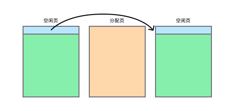

# 更适合北大宝宝体质的 xv6 OS Lab 踩坑记 - Part5

Part5 的核心就是两个关键词：

-   写时复制（Copy-on-Write, COW）
-   懒分配（Lazy Allocation）

助教给了两个对应的测例：

-   `test_mem_cow`
-   `test_mem_lazy_allocation`

我们要做的，是把内核的内存子系统改造成支持这两种机制，并且通过 `getpgcnt` / `getprocsz` 这样的辅助系统调用，把内核里 “真实占用的物理页数” 和 “进程逻辑地址空间大小” 暴露给测试程序，从而通过评测。

## 评测框架

在 Part4 里我们通过 `SCHEDULER_TYPE` + `ENABLE_JUDGER` 这套宏体系，把调度算法的测试框架接了进来。Part5 做的是同一套事情，只不过这次切的是内存机制而不是调度器。

`Makefile` 中新增了一组宏（简化版）：

```makefile
# Part 5: 选择内存机制测试类型
TYPE =

ifneq ($(TYPE),)
  CFLAGS += -DTYPE
  USER_CFLAGS += -DTYPE
endif

ifeq ($(TYPE), COW)
	TEST_PROGRAM = test_mem_cow
	CFLAGS += -DTYPE_COW
	USER_CFLAGS += -DTYPE_COW
else ifeq ($(TYPE), LAZY)
	TEST_PROGRAM = test_mem_lazy_allocation
	CFLAGS += -DTYPE_LAZY_ALLOCATION
	USER_CFLAGS += -DTYPE_LAZY_ALLOCATION
endif
```

含义：

-   `TYPE=COW` 时：
    -   编译器会看到 `TYPE` 和 `TYPE_COW` 两个宏
    -   `TEST_PROGRAM` 被设置为 `test_mem_cow`
-   `TYPE=LAZY` 时：
    -   编译器会看到 `TYPE` 和 `TYPE_LAZY_ALLOCATION` 两个宏
    -   `TEST_PROGRAM` 被设置为 `test_mem_lazy_allocation`

配合 Part4 中，使用 `run_test` 命令启动时注入的 `ENABLE_JUDGER` 宏，就可以类似这样跑评测：

```bash
make run_test TYPE=COW
make run_test TYPE=LAZY
```

为了在同一个用户态框架下既支持 Part4，又支持 Part5，`xv6-user/init.c`、`xv6-user/testcases/judger.c` 和 `xv6-user/testcases/test.h` 都做了一套条件编译拆分：

-   当定义了 `ENABLE_JUDGER && SCHEDULER_TYPE` 时，走 Part4 调度器评测逻辑；
-   当定义了 `ENABLE_JUDGER && TYPE` 时，走 Part5 COW / 懒分配评测逻辑。

比如 `xv6-user/init.c` 里：

```c
// Part 4
#if defined(ENABLE_JUDGER) && defined(SCHEDULER_TYPE)
  // ... 调度器测试框架 ...
// Part 5
#elif defined(ENABLE_JUDGER) && defined(TYPE)
  // ... 内存机制测试框架 ...
#else
  // ... 平时本地多测例 init ...
#endif
```

两块框架本质上是同一个套路：

1. `init` 用 `TEST_PROGRAM` 启动指定测例子进程；
2. 把测例的标准输出通过 `pipe` 收集到 `test_outputs`；
3. 再启动 `judger`，把 “类型编号 + 输出字符串” 作为参数扔过去；
4. `judger` 在用户态用字符串匹配判断是否 AC，并在最后打印 `SCORE: x`。

Part5 的 `judger` 逻辑更简单，只看输出里有没有：

```text
Copy-on-Write Test Completed Successfully
Lazy Allocation Test Completed Successfully
```

同时确保没有 `ERROR` 字样。

## 初始物理页表管理机制

这里，我们需要先介绍一下原有的物理页表管理机制：

核心数据结构和函数都定义在 `kernel/kalloc.c` 中：

```c
// kernel/kalloc.c
struct {
  struct spinlock lock; // 用于保护物理内存分配器的互斥锁（自旋锁）
  struct run *freelist; // 用于管理空闲物理页的链表
  uint64 npage; // 当前系统中空闲的物理页数
} kmem;

struct run {
  struct run *next;
};
```

其中，`freelist` 是一个单向链表，每个节点都是一个空闲物理页，`next` 指向下一个空闲物理页。

你可能会感到疑惑，画个图或许会好理解一些：



物理页地址和 `run` 指针是同一个值，**只是在空闲时把页首当作链表节点，分配给别人时恢复成全为负载的普通分配页**。

`kinit()` 是物理内存分配器的初始化函数，负责设置初始状态：

```c
void
kinit()
{
  initlock(&kmem.lock, "kmem");
  kmem.freelist = 0;
  kmem.npage = 0;
  freerange(kernel_end, (void*)PHYSTOP);
  #ifdef DEBUG
  printf("kernel_end: %p, phystop: %p\n", kernel_end, (void*)PHYSTOP);
  printf("kinit\n");
  #endif
}

void
freerange(void *pa_start, void *pa_end)
{
  char *p;
  p = (char*)PGROUNDUP((uint64)pa_start);
  for(; p + PGSIZE <= (char*)pa_end; p += PGSIZE)
    kfree(p);
}
```

`freerange()` 是一个辅助函数，用于将一段物理地址范围（`pa_start` 到 `pa_end`）内的物理页释放回空闲链表。

```c
// Free the page of physical memory pointed at by v,
// which normally should have been returned by a
// call to kalloc().  (The exception is when
// initializing the allocator; see kinit above.)
void
kfree(void *pa)
{
  struct run *r;

  if(((uint64)pa % PGSIZE) != 0 || (char*)pa < kernel_end || (uint64)pa >= PHYSTOP)
    panic("kfree");

  // Fill with junk to catch dangling refs.
  memset(pa, 1, PGSIZE);

  r = (struct run*)pa;

  acquire(&kmem.lock);
  r->next = kmem.freelist;
  kmem.freelist = r;
  kmem.npage++;
  release(&kmem.lock);
}
```

`kfree()` 是物理内存释放函数，负责将一页物理内存释放回空闲链表。其会将一个物理页填充垃圾数据（`0x01`），并将该物理页添加到空闲链表的头部，最后增加空闲页计数器 `npage`。

```c
// Allocate one 4096-byte page of physical memory.
// Returns a pointer that the kernel can use.
// Returns 0 if the memory cannot be allocated.
void *
kalloc(void)
{
  struct run *r;

  acquire(&kmem.lock);
  r = kmem.freelist;
  if(r) {
    kmem.freelist = r->next;
    kmem.npage--;
  }
  release(&kmem.lock);

  if(r)
    memset((char*)r, 5, PGSIZE); // fill with junk
  return (void*)r;
}
```

`kalloc()` 是物理内存分配函数，负责从空闲链表中分配一页物理内存。其会从 `freelist` 中取出一页物理内存，并减少空闲页计数器 `npage`，最后返回该物理页的地址。

## 辅助系统调用

要在用户态测试 “物理页数” 和 “逻辑地址空间大小”，直接从 C 语言里算是不行的，只能靠内核给我们提供观测接口。

所以，我们需要在 `kernel/include/sysnum.h` 里新增两个系统调用号：

```c
#define SYS_getprocsz  500   // 获取进程的内存使用情况
#define SYS_getpgcnt   501   // 获取当前已分配物理内存的页数
```

### sys_getprocsz

`sys_getprocsz` 可以直接干净实现：

```c
// kernel/sysproc.c
/**
 * @brief 实现 getprocsz 系统调用，获取进程的堆顶地址。
 * @return 进程的堆顶地址
 */
uint64 sys_getprocsz(void) {
  acquire(&myproc()->lock);
  int sz = myproc()->sz;
  release(&myproc()->lock);
  return sz;
}
```

回顾一下我们在 Part2 中提到的，用户态地址空间结构：

```
+------------------+  <-- MAXVA = 0x4000000000
|   Guard Page     |  (无效页，防护用)
+------------------+  <-- TRAMPOLINE = 0x3FFFFFF000
|  Trampoline Page |  (用户/内核共享的一页)
+------------------+  <-- TRAPFRAME = 0x3FFFFFE000
|  Trapframe Page  |  (每进程陷入帧)
+------------------+
|  ...             |  区间： [MMAPBASE, TRAPFRAME)
+------------------+  <-- MMAPBASE = 0x60000000
|  mmap region     |  (mmap 最高地址在此，向下扩展 ↓)
+------------------+
|  ...             |  （未用/保留/映射空洞）
+------------------+
|  heap (upward)   |  (从 data/bss 之后向上增长 ↑)
+------------------+
|  User Stacks     |  (用户栈区，1 页大小，固定大小，不增长)
+------------------+  <-- STACKBASE
|   Guard Page     |  (无效页，1 页大小，防护用)
+------------------+
|  data / bss      |
+------------------+
|  text            |
+------------------+  <-- 0x00000000
```

这里的 `p->sz` 是进程用户态地址空间的 “逻辑大小”，本质上就是当前的 “堆顶” 地址，也就是用户态地址空间中，`heap` 区域的顶部地址（注意这里布局和标准的 Linux 地址空间布局不一致）。

### sys_getpgcnt

`getpgcnt` 的语义是：**全局维度上，当前系统实际占用了多少物理页**。语义上，其应当是所有可用物理页数减去空闲物理页数，这在原始的代码框架中可以表示为：

```c
uint64 total_pages = ((void*)PHYSTOP) / PGSIZE; // 所有可用物理页数
uint64 used_pages = total_pages - kmem.npage; // 已使用物理页数
```

由于我们后续会改造物理内存分配器，因此这里暂时先不实现 `getpgcnt` 系统调用，占位即可：

```c
/**
 * @brief TODO: 实现 getpgcnt 系统调用，获取当前已分配物理内存的页数。
 * @return 当前已分配物理内存的页数
 */
uint64 sys_getpgcnt(void) {
  return 0;
}
```

`test_mem_cow` / `test_mem_lazy_allocation` 都是通过多次调用 `getpgcnt()`，来观察 fork /sbrk/ 读写等操作对 “物理页数” 造成的影响，从而间接验证 COW 和懒分配是否工作正常。

由于他们彼此机制上并不冲突，并且正确实现后对于已有测例均无影响，所以我们在后续的实现中可以不像 Part4 那样到处做条件编译，直接实现即可。

## 物理内存分配器改造

COW 的核心是 “同一物理页被多个进程共享”，而原先的 `kfree()` 默认 “一次 free 就回收这一页”，现在则必须 “直到没人引用这页，才能真正回收”。

所以，我们必须引入新的机制来管理物理页的引用计数。这里为了方便，我们删掉了原有的 `npage`，替换为语义更明确的 `totalpages` 和 `freepages`。

```c
// kernel/kalloc.c
#define MAX_PHYS_PAGES (PHYSTOP / PGSIZE)

struct {
  struct spinlock lock;
  struct run *freelist;
  uint64 freepages; // 空闲页数
  uint64 totalpages; // 总分配物理页数（包括空闲页），小于等于 MAX_PHYS_PAGES
  int refcnt[MAX_PHYS_PAGES]; // 引用计数，用于 COW
} kmem;
```

通过 `pa >> PGSHIFT` 直接当作 refcnt 数组下标（中间有个 `pa2index()` 做安全检查）：

```c
// kernel/include/riscv.h
#define PGSIZE 4096 // bytes per page
#define PGSHIFT 12  // bits of offset within a page

// kernel/kalloc.c
/**
 * @brief 将物理地址转换为 refcnt 索引
 * @param pa 物理地址，要求必须对齐到 PGSIZE
 * @return refcnt 数组的索引
 */
static inline int
pa2index(uint64 pa)
{
  if(pa % PGSIZE)
    panic("pa2index");
  if(pa >= PHYSTOP)
    panic("pa2index");
  return pa >> PGSHIFT;
}
```

辅助接口：

```c
/**
 * @brief 增加引用计数
 * @param pa 物理地址
 * @note 增加引用计数，用于 COW
 */
void
incref(uint64 pa)
{
  acquire(&kmem.lock);
  int idx = pa2index(pa);
  kmem.refcnt[idx]++;
  release(&kmem.lock);
}

/**
 * @brief 获取引用计数
 * @param pa 物理地址
 * @return 引用计数
 */
int
getref(uint64 pa)
{
  acquire(&kmem.lock);
  int idx = pa2index(pa);
  int cnt = kmem.refcnt[idx];
  release(&kmem.lock);
  return cnt;
}
```

### kinit

`kinit()` 负责初始化物理内存分配器。

这里没啥修改，主要是将新增两个字段 `freepages` 和 `totalpages` 初始化为 0。

```c
void
kinit()
{
  initlock(&kmem.lock, "kmem");
  kmem.freelist = 0;
  kmem.freepages = 0;
  kmem.totalpages = 0;
  freerange(kernel_end, (void*)PHYSTOP);
  #ifdef DEBUG
  printf("kernel_end: %p, phystop: %p\n", kernel_end, (void*)PHYSTOP);
  printf("kinit\n");
  #endif
}
```

### kalloc

`kalloc()` 负责分配物理内存。

-   从 `freelist` 取出一页；
-   `freepages--`；
-   把对应的 `refcnt[idx]` 置为 1（ **初始只有一个引用** ）；

```c
// Allocate one 4096-byte page of physical memory.
// Returns a pointer that the kernel can use.
// Returns 0 if the memory cannot be allocated.
void *
kalloc(void)
{
  struct run *r;

  acquire(&kmem.lock);
  r = kmem.freelist;
  if(r) {
    kmem.freelist = r->next;
    // 这里必然是初次分配，所以减少空闲页数，并设置引用计数为 1
    kmem.freepages--;
    kmem.refcnt[pa2index((uint64)r)] = 1;
  }
  release(&kmem.lock);

  if(r)
    memset((char*)r, 5, PGSIZE); // fill with junk
  return (void*)r;
}
```

### kfree

`kfree()` 负责释放物理内存。

这里不再直接无脑回收到 freelist：

1. 根据物理地址拿到 idx；
2. 检查 `refcnt[idx] >= 1`，否则 panic（说明逻辑有 bug）；
3. `refcnt[idx]--`；
4. 如果减完后仍 > 0，说明还有别的 PTE 在用这页，**直接返回，不真正回收**；
5. 只有减到 0 时，才把这页挂回 `freelist`，并 `freepages++`。

```c
// Free the page of physical memory pointed at by v,
// which normally should have been returned by a
// call to kalloc().  (The exception is when
// initializing the allocator; see kinit above.)
void
kfree(void *pa)
{
  struct run *r;

  if(((uint64)pa % PGSIZE) != 0 || (char*)pa < kernel_end || (uint64)pa >= PHYSTOP)
    panic("kfree");

  // 首先解析物理地址，并转换为 refcnt 索引
  uint64 addr = (uint64)pa;
  int idx = pa2index(addr);

  // 获取锁，并检查引用计数是否大于 0
  // 若引用计数小于 1，则 panic
  // 若引用计数大于 0，则递减引用计数，并返回
  // 若引用计数等于 0，则说明这是最后一次引用，可以真正释放物理页，填充垃圾值，并重新挂回 freelist
  acquire(&kmem.lock);
  if(kmem.refcnt[idx] < 1)
    panic("kfree");
  kmem.refcnt[idx]--;
  if(kmem.refcnt[idx] > 0){
    release(&kmem.lock);
    return;
  }

  // Fill with junk to catch dangling refs.
  memset(pa, 1, PGSIZE);

  r = (struct run*)pa;

  r->next = kmem.freelist;
  kmem.freelist = r;
  kmem.freepages++;
  release(&kmem.lock);
}
```

### freerange

`kinit()` 调用 `freerange(kernel_end, PHYSTOP)` 时，就顺便把 `totalpages` 和 `refcnt` 初始化好：

```c
void
freerange(void *pa_start, void *pa_end)
{
  char *p;
  p = (char*)PGROUNDUP((uint64)pa_start);
  for (; p + PGSIZE <= (char*)pa_end; p += PGSIZE) {
    // 现在在初始阶段会计数总分配物理页数，并调用 incref 增加引用计数（对于 COW 来说，这里就是设置为 1）
    kmem.totalpages++;
    incref((uint64)p);
    kfree(p);
  }
}
```

### allocated_pages

最终 `totalpages` 基本等于 “物理内存总页数”，而 `freepages` 则随着运行动态变化。`getpgcnt` 就从这两个数字做减法即可。

```c
// kernel/sysproc.c
/**
 * @brief 实现 getpgcnt 系统调用，获取当前已分配物理内存的页数。
 * @return 当前已分配物理内存的页数
 */
uint64 sys_getpgcnt(void) {
  return allocated_pages();
}

// kernel/kalloc.c
/**
 * @brief 获取总使用物理页数
 * @return 总使用物理页数
 * @note 总使用物理页数 = 总分配物理页数 - 空闲物理页数
 */
uint64
allocated_pages(void)
{
  uint64 freepages, totalpages;
  acquire(&kmem.lock);
  freepages = kmem.freepages;
  totalpages = kmem.totalpages;
  release(&kmem.lock);
  if (totalpages < freepages) {
    return 0;
  }
  return totalpages - freepages;
}
```

## 懒分配

懒分配的目标是：

1. `sbrk` / `brk` 只改变进程的逻辑地址空间上限，不立刻分配物理页
2. 等到真正访问某个地址时，再在缺页异常里分配对应页

### growproc

堆分配最终是调用了 `growproc()` 函数，其进而调用了 `uvmalloc()` 和 `uvmdealloc()`，最终封装的还是 `kalloc()` 和 `kfree()`。

其整体逻辑可以理解如下：

-   如果 `n > 0`，则调用 `uvmalloc()` 在 $[\texttt{oldsz},\ \texttt{newsz})$ 区间里一页一页地使用 `kalloc()` 分配物理内存。
-   如果 `n < 0`，则调用 `uvmdealloc()` 在 $[\texttt{newsz},\ \texttt{oldsz})$ 区间里一页一页地使用 `kfree()` 释放物理内存。

```c
// kernel/proc.c
// Grow or shrink user memory by n bytes.
// Return 0 on success, -1 on failure.
int
growproc(int n)
{
  uint sz;
  struct proc *p = myproc();

  sz = p->sz;
  if(n > 0){
    if((sz = uvmalloc(p->pagetable, p->kpagetable, sz, sz + n)) == 0) {
      return -1;
    }
  } else if(n < 0){
    sz = uvmdealloc(p->pagetable, p->kpagetable, sz, sz + n);
  }
  p->sz = sz;
  return 0;
}
```

为了实现懒分配，我们需要将分配时机延迟到最后，也即真正访问某个地址时，再在缺页异常里分配对应页。

所以，我们修改 `growproc()` 的逻辑：

-   扩大堆：**只改 `sz`，不分配物理页**
-   缩小堆：`uvmdealloc` + 更新 `sz`，回收超过 `new_sz` 的那部分映射

```c
// Grow or shrink user memory by n bytes.
// Return 0 on success, -1 on failure.
int
growproc(int n)
{
  struct proc *p = myproc();
  uint64 sz = p->sz;

  if (n > 0) {
    // 懒分配，此时不进行 uvmalloc 分配物理页，只更新 sz，等到用到的时候再通过触发缺页异常来分配物理页
    uint64 newsz = sz + (uint64)n;
    if (newsz < sz)
      return -1;
    if (newsz >= MMAPBASE)
      return -1;
    p->sz = newsz;
  } else if(n < 0){
    uint64 delta = (uint64)(-n);
    uint64 newsz = (delta > sz) ? 0 : sz - delta;
    uvmdealloc(p->pagetable, p->kpagetable, sz, newsz);
    p->sz = newsz;
  }
  return 0;
}
```

对应到 `sbrk()` / `brk()` 系统调用，就意味着：

-   `sbrk(SIZE)` 之后，`getprocsz` 会变大，但 `getpgcnt` 暂时不变
-   只有访问堆上的新地址时，才会触发缺页异常，由异常处理程序负责真正分配页

### lazy_handler

类似之前 Part2 中 VMA 的懒分配，我们在 `kernel/trap.c` 中增加了一个 `lazy_handler()` 专门处理堆上的懒分配缺页异常。

其首先进行基础权限检查，这要求访问的地址 `stval`：

-   `< p->sz`（逻辑堆顶）；
-   `< MMAPBASE`（避免踩到 mmap 区间）；

若通过检查，然后发现对应页表项目前还没分配，就在这里分配一页物理内存，并同时映射到用户页表和内核页表（注意内核页表不要带 `PTE_U`）。

这里有关页面映射的 API 以及相关机制的详细讲解，可以参考 Part2 的笔记。

```c
// kernel/trap.c
/**
 * @brief 处理堆懒分配的缺页异常
 * @param p 进程
 * @param stval 异常地址
 * @return 0 成功，-1 失败
 */
static int
lazy_handler(struct proc *p, uint64 stval)
{
  // 地址超出堆上限地址或者 mmap 区上限地址，返回错误
  if (stval >= p->sz || stval >= MMAPBASE) {
    return -1;
  }

  // 仿照 vma_handler 的逻辑，分配一页物理内存，并映射到用户页表、内核页表
  uint64 va_page_start = PGROUNDDOWN(stval);
  pte_t* pte = walk(p->pagetable, va_page_start, 0);
  // 如果查到有效 PTE，说明实际已经分配了物理页，直接返回错误
  if (pte && (*pte & PTE_V)) {
    return -1;
  }

  // 分配一页物理内存
  char* mem = kalloc();
  // 分配失败，返回错误
  if (mem == 0) {
    printf("lazy_handler(): out of memory\n");
    p->killed = 1;
    return 0;
  }
  // 将新分配的页清零
  memset(mem, 0, PGSIZE);

  // 用户态页表项标志位
  int pte_flags = PTE_W | PTE_X | PTE_R | PTE_U;
  if (mappages(p->pagetable, va_page_start, PGSIZE, (uint64)mem, pte_flags) != 0) {
    kfree(mem);
    printf("lazy_handler(): mappages failed\n");
    p->killed = 1;
    return 0;
  }
  // 内核态页表项标志位
  int kpte_flags = pte_flags & ~PTE_U;
  if (mappages(p->kpagetable, va_page_start, PGSIZE, (uint64)mem, kpte_flags) != 0) {
    kfree(mem);
    vmunmap(p->pagetable, va_page_start, 1, 1);
    printf("lazy_handler(): kernel mappages failed\n");
    p->killed = 1;
    return 0;
  }

  return 0;
}
```

这个 Handler 最后会和其他 Handler 一起，在 `usertrap()` 中检测到缺页异常时被顺序调用，稍后会给出具体实现。

## 写时复制

COW 的 “用户视角” 很简单：`fork()` 后父子进程各有一份地址空间；在任何一方第一次写某页时，才真正拷贝一份物理页。

要在 xv6 里做这件事，大致分三步：

1. `fork` 时不再立即拷贝物理页，而是让父子共享页，把 PTE 标成 COW
2. 为每个物理页维护引用计数，防止被提前 `kfree`
3. 写缺页时做 “按需复制”

### PTE_COW

为了实现 COW，我们需要新的 PTE 标志位，在 `kernel/include/riscv.h` 中新增一下：

```c
#define PTE_COW (1L << 8) // COW 写时复制标志
```

这个位只在 “用户页表” 里有意义，用来标记这是一个 COW 页。内核页表中不会依赖这个标记来做判断。

### uvmcopy

`fork` 时会调用 `uvmcopy` 来将父进程的地址空间（即用户页表）复制到子进程。

你可能会好奇为什么这里不用复制内核态页表，答案是其这部分在 `fork` 里调用 `allocproc()` （从而调用 `proc_kpagetable()`）时已经自动复制好了。

其实内核态页表实际上可以看做以下三部分：

-   全局 `kernel_pagetable`：在 `proc_kpagetable()` 里直接拷贝，提供所有进程都会用到的内核虚拟空间映射，包含内核代码 / 数据、设备寄存器、trampoline 等，全局共享，从而进入内核后就能无缝访问这些常驻资源
-   私有内核栈：在 `proc_kpagetable()` 里单独分配，用于内核态执行系统调用、中断或缺页处理时需要栈空间保存寄存器和局部变量
-   用户页表的复制，但是不带 `PTE_U`：在 `uvmalloc`、`uvmcopy` 等路径会把用户页的映射复制到 `kpagetable`。让内核能够直接访问该进程的用户物理页（拷贝参数、处理 COW、补全缺页等），但限制只能内核态使用

所以，`uvmcopy()` 只需要处理最后一部分即可，即同时完成：

1. 把父进程每一页的映射复制到子进程的用户页表里，同时考虑是否要把该页降权为 COW（无写权限 + `PTE_COW`）
2. 把同一批映射同步到子进程的内核页表（不带 `PTE_U`、`PTE_COW`），以便未来内核访问（内核访问需要写权限但不会依赖 `PTE_COW`）
3. 一旦决定共享页（`need_cow`），就要给物理页做 `incref` 并把父亲的 PTE 也改成 COW（无写权限 + `PTE_COW`）
4. 任意一步失败都要把已经做出的更改撤销（包括父页表），否则 `fork` 失败后父进程就陷入页表无写权限的情况

设置 `PTE_COW` 的条件：父页可写（`PTE_W`）或已是 COW（`PTE_COW`），前者好理解，后者对应父子进程第一次 `fork` 后，第二次 `fork` 时的情况，此时第一次 `fork` 时已经共享了页，第二次 `fork` 时仍需要再次共享页。

```c
// kernel/vm.c
/**
 * @brief 回滚 COW 操作，将 PTE_COW 标记的页恢复为可写状态
 * @param pagetable 页表
 * @param upto 要回滚的结束地址
 * @note 用于在 fork 失败时恢复父进程的页表状态
 */
static void
revert_cow(pagetable_t pagetable, uint64 upto) {
  for (uint64 va = 0; va < upto; va += PGSIZE) {
    pte_t* pte = walk(pagetable, va, 0);
    // 页表项不存在，跳过
    if (pte == 0)
      continue;
    // 页表项无效，跳过
    if ((*pte & PTE_V) == 0)
      continue;
    // 页表项不是 COW 页，跳过
    if ((*pte & PTE_COW) == 0)
      continue;
    // 获取物理页地址
    uint64 pa = PTE2PA(*pte);
    // 如果物理页引用计数为 1，则恢复为可写状态
    if (getref(pa) == 1) {
      // 强制加写权限，移除 COW 位
      uint64 flags = (PTE_FLAGS(*pte) | PTE_W) & ~PTE_COW;
      *pte = PA2PTE(pa) | flags;
    }
  }
}

// Given a parent process's page table, copy
// its memory into a child's page table using
// copy-on-write(COW) semantics.
// returns 0 on success, -1 on failure.
// frees any allocated pages on failure.
int
uvmcopy(pagetable_t old, pagetable_t new, pagetable_t knew, uint64 sz)
{
  pte_t *pte;
  uint64 pa, i = 0, ki = 0;
  uint flags;

  while (i < sz){
    if((pte = walk(old, i, 0)) == NULL)
      panic("uvmcopy: pte should exist");
    if((*pte & PTE_V) == 0)
      panic("uvmcopy: page not present");
    pa = PTE2PA(*pte);
    flags = PTE_FLAGS(*pte);
    uint64 child_flags = flags;
    int need_cow = 0;

    // 如果父页是可写或已经是 COW，说明需要共享页
    // 已经是 COW 的情况：fork() 之后又有 fork()
    if ((flags & PTE_W) || (flags & PTE_COW)) {
      // 移除 PTE_W，增加 PTE_COW
      child_flags &= ~PTE_W;
      child_flags |= PTE_COW;
      need_cow = 1;
    }

    // 将子用户页表项相应虚拟页映射到父进程对应页表项的物理页，权限为 child_flags
    if (mappages(new, i, PGSIZE, pa, child_flags) != 0) {
      goto err;
    }
    i += PGSIZE;

    // 内核态页表项需要先移除 PTE_U 和 PTE_COW 标志
    // PTE_COW 在内核态页表项中没有意义，发生写异常时是根据用户态页表项的 PTE_COW 位来决定是否触发写时复制
    // 如果触发，会清除同一物理页的所有用户态页面 PTE_COW 位，并新分配物理页然后拷贝数据、更新内核态用户态页表项
    uint64 kchild_flags = child_flags;
    kchild_flags &= ~PTE_U;
    kchild_flags &= ~PTE_COW;
    if (mappages(knew, ki, PGSIZE, pa, kchild_flags) != 0) {
      goto err;
    }
    // 增加物理页引用计数
    incref(pa);

    // 如果需要触发写时复制，则更新父页表项，设置权限与 child_flags 相同
    // 即无 PTE_W，有 PTE_COW
    if (need_cow) {
      *pte = PA2PTE(pa) | child_flags;
    }
    ki += PGSIZE;
  }

  // 刷新 TLB
  sfence_vma();
  return 0;

 err:
  vmunmap(knew, 0, ki / PGSIZE, 0);
  vmunmap(new, 0, i / PGSIZE, 1);
  revert_cow(old, i);
  sfence_vma();
  return -1;
}
```

### 写时复制真正发生的地方

上述修改仅仅是完成了父子进程页表的复制、权限的设置，但并没有真正实现写时复制。

写时复制真正发生的地方是：

1. 当父子进程中任意一方尝试写共享页时，会触发缺页异常，然后在 `usertrap()` 中由异常处理程序处理。
2. 当内核主动写用户页时，会调用 `copyout2()`。此时也需要进行 COW 判断是否需要进行写时复制。

其实第二点理论上来讲可以通过内核页表 + `kerneltrap()` 来实现，但我们考虑到简便性，加之之前也没在内核页表中设置 `PTE_COW` 以让内核能比较好地判断是否需要 COW，所以直接把逻辑留在 `copyout2()` 即可。

#### cow_handler

`usertrap()` 一旦看到 `scause == 15` 并且对应 PTE 带 `PTE_COW`，就会先走 `cow_handler()`，而 `cow_handler()` 的主体就是调用 `cow_make_writable()`。

```c
// kernel/trap.c
/**
 * @brief 处理写时复制时的缺页异常
 * @param p 进程
 * @param scause 异常原因
 * @param stval 异常地址
 * @return 0 成功，-1 失败
 */
static int
cow_handler(struct proc *p, uint64 scause, uint64 stval)
{
  // scause 15：存储 / AMO 页面故障
  // 写时复制异常只能是存储访问异常
  if (scause != 15) {
    return -1;
  }

  uint64 va = PGROUNDDOWN(stval);
  pte_t *pte = walk(p->pagetable, va, 0);
  if (pte == 0) {
    return -1;
  }
  // 页表项不是 COW 页，直接返回
  if ((*pte & PTE_COW) == 0) {
    return -1;
  }

  // 处理写时复制
  if (cow_make_writable(p, va) < 0) {
    printf("cow_handler(): out of memory\n");
    p->killed = 1;
  }
  return 0;
}
```

`cow_make_writable()` 在 `kernel/vm.c` 里，把恢复写权限还是新分配页这两个分支拆得很清楚：

-   若 `getref(pa) == 1` 代表只有当前进程在用：直接改用户 PTE / 内核 PTE 的标志位，恢复 `PTE_W` 并清空 `PTE_COW`，再 `sfence_vma()` 刷新 TLB 就能继续写
-   若引用计数大于 1，就说明至少两个进程在共享：此时 `kalloc()` 一页，把旧数据 `memmove()` 过去，再分别更新用户页表和内核页表；最后 `kfree(old_pa)` 让引用计数减一（真正是否回收交给 `kfree()` 内部判断）
-   任何异常都会让 `cow_handler()` 把当前进程标记为 `killed`，以免写错页。

```c
// kernel/vm.c
/**
 * @brief 对给定虚拟地址所在的页，如果是 COW 页，则根据引用计数决定是直接恢复写权限还是复制一份新页，同时同步更新用户页表和内核页表。
 * @param p 进程
 * @param va 虚拟地址
 * @return 0 成功，-1 失败
 */
int
cow_make_writable(struct proc *p, uint64 va)
{
  pagetable_t pagetable = p->pagetable;
  uint64 va0 = PGROUNDDOWN(va);
  pte_t* pte = walk(pagetable, va0, 0);
  // 页表项不存在或无效，返回错误
  if (pte == 0 || (*pte & PTE_V) == 0)
    return -1;
  // 页表项不是 COW 页，直接返回
  if((*pte & PTE_COW) == 0)
    return 0;

  // 获取物理页地址
  uint64 pa = PTE2PA(*pte);
  int ref = getref(pa);
  // 引用计数小于 1，panic
  if (ref < 1) {
    panic("cow_make_writable");
  }

  // 引用计数为 1，说明是最后一个引用
  if (ref == 1) {
    // 直接恢复 PTE_W 位、移除 PTE_COW 位
    uint64 flags = (PTE_FLAGS(*pte) | PTE_W) & ~PTE_COW;
    *pte = PA2PTE(pa) | flags;
    // 类似地更新内核页表
    pte_t* kpte = walk(p->kpagetable, va0, 0);
    if(kpte == 0)
      panic("cow_make_writable kpte");
    uint64 kflags = (PTE_FLAGS(*kpte) | PTE_W) & ~PTE_COW;
    *kpte = PA2PTE(pa) | kflags;
    sfence_vma();
    return 0;
  }

  // 引用计数 > 1，触发写时复制，需要分配新页、复制数据、更新父进程和其内核页表
  char* mem = kalloc();
  if(mem == 0)
    return -1;
  memmove(mem, (char*)pa, PGSIZE);
  // 更新用户页表，设置 PTE_W 位、移除 PTE_COW 位
  uint64 flags = (PTE_FLAGS(*pte) | PTE_W) & ~PTE_COW;
  *pte = PA2PTE((uint64)mem) | flags;
  // 类似地更新内核页表
  pte_t* kpte = walk(p->kpagetable, va0, 0);
  if(kpte == 0)
    panic("cow_make_writable kpte");
  uint64 kflags = (PTE_FLAGS(*kpte) | PTE_W) & ~PTE_COW;
  *kpte = PA2PTE((uint64)mem) | kflags;
  sfence_vma();
  kfree((void*)pa);
  return 0;
}
```

#### copyout2

只要内核里有把数据写回用户缓冲区的地方（例如 `sys_wait`、`file`、`pipe`、`nanosleep` 等），最后都会走 `copyout2()`。如果 `copyout2()` 没有 COW 逻辑，内核直接 `memmove` 就会绕过写缺页，导致父子共享页被一起污染。

所以，这里需要把 `copyout2()` 改成逐页处理 + 每页先调用 `cow_make_writable()` 确保可写。

逻辑顺序是：

1. 检查 `dstva + len` 是否超过 `p->sz`，防止写到堆之外
2. 逐页循环，每次定位 `va0 = PGROUNDDOWN(dstva)`
3. 先执行 `cow_make_writable()` 保证该页处于可写状态（如果还是 COW，会在这里做真正的复制）
4. 计算本页剩余可写字节 `n` 并 `memmove()`
5. 继续跳到下一页直到写完

这样 `copyout2()` 既能满足过去的语义，又能在 COW 环境里正确地触发缺页。

```c
/**
 * @brief 将内核空间的数据拷贝到用户空间
 * @param dstva 目标虚拟地址
 * @param src 源数据
 * @param len 长度
 * @return 0 成功，-1 失败
 */
int
copyout2(uint64 dstva, char *src, uint64 len)
{
  struct proc *p = myproc();
  uint64 sz = p->sz;
  if (dstva + len > sz || dstva >= sz) {
    return -1;
  }
  // 这里原先是直接一个大的 memmove，但是我们现在要处理 COW，所以必须保证每次复制都在一个整页以内
  while (len > 0) {
    uint64 va0 = PGROUNDDOWN(dstva);
    // 处理 COW，确保目标页可写
    if (cow_make_writable(p, va0) < 0){
      return -1;
    }
    // 拷贝数据，初次拷贝可能非整页，而是复制了 [dstva, va0+PGSIZE) 之间的数据
    // 后续拷贝时，n 就是整页大小 PGSIZE
    // 最后一次拷贝时，n = len <= PGSIZE
    uint64 n = PGSIZE - (dstva - va0);
    if (n > len)
      n = len;
    memmove((void *)dstva, src, n);
    len -= n;
    src += n;
    dstva = va0 + PGSIZE;
  }
  return 0;
}
```

## usertrap

至此，我们基本上就已经完成了懒分配 + 写时复制的全部逻辑，最后只需要将三个和缺页相关的 Handler 合并在一起，从而保证在 `usertrap()` 中能够正确地处理缺页异常即可：

-   `cow_handler()`：处理写时复制缺页异常
-   `vma_handler()`：处理 mmap 区缺页异常，需要从之前的代码中提取出来
-   `lazy_handler()`：处理堆区懒分配缺页异常

```c
// kernel/trap.c
/**
 * @brief 处理用户页缺页异常
 * @param p 进程
 * @param scause 异常原因
 * @param stval 异常地址
 * @return 0 成功，-1 失败
 */
static int
handle_user_page_fault(struct proc *p, uint64 scause, uint64 stval)
{
  if (cow_handler(p, scause, stval) == 0) {
    return 0;
  }
  if (vma_handler(p, scause, stval) == 0) {
    return 0;
  }
  if (lazy_handler(p, stval) == 0) {
    return 0;
  }
  return -1;
}
```

`usertrap()` 里简化成：

```c
// kernel/trap.c
uint64 scause = r_scause();
uint64 stval  = r_stval();

if (scause == 12 || scause == 13 || scause == 15) {
  if (handle_user_page_fault(p, scause, stval) < 0) {
    printf("usertrap(): segfault pid=%d %s, va=%p\n", p->pid, p->name, stval);
    p->killed = 1;
  }
}
```

调用顺序按照 “最专门 → 最通用” 的思路排列：

1. `cow_handler()`：只有写 COW 页才会触发，且一定是 `scause == 15`
2. `vma_handler()`：mmap 区既可能因为懒分配缺页，也可能因为权限不允许导致 fault，它们都在这里完成
3. `lazy_handler()`：最后兜底堆区懒分配

如果三个 Handler 都回 -1，就说明这次缺页属于真正的非法访问，`usertrap()` 会打印 `segfault` 并标记进程 `killed`。

## 测试

### COW

```bash
make run_test TYPE=COW
```

得到输出：

```
hart 0 init done
Starting test program: test_mem_cow
Target type: COW

init: starting test_mem_cow
testing output size:539, contents:
Testing Copy-on-Write
Initial physical pages: 43
Physical pages after initialization: 44 (should be +1)
PhPhysical pages afteysical pages after fork: 57
Physicalr fork: 56
 pages before child read: 57
Child read sum: 522240
Physical pages after child read: 57 (should be same)
Physical pages after child write: 58 (should be increased)
wait status:0
Parent read sum: 522240
Physical pages after child exit: 44 (should be same as before read)
Physical pages after parent write: 44 (should be same)
Copy-on-Write Test Completed Successfully
init: process pid=2 exited
init: test execution completed, starting judger
Judger: Starting evaluation
Test1 output:
Testing Copy-on-Write
Initial physical pages: 43
Physical pages after initialization: 44 (should be +1)
PhPhysical pages afteysical pages after fork: 57
Physicalr fork: 56
 pages before child read: 57
Child read sum: 522240
Physical pages after child read: 57 (should be same)
Physical pages after child write: 58 (should be increased)
wait status:0
Parent read sum: 522240
Physical pages after child exit: 44 (should be same as before read)
Physical pages after parent write: 44 (should be same)
Copy-on-Write Test Completed Successfully

TEST 1 PASSED
SCORE: 1
init: judger completed
```

### LAZY

```bash
make run_test TYPE=LAZY
```

得到输出：

```
hart 0 init done
Starting test program: test_mem_lazy_allocation
Target type: Lazy Allocation

init: starting test_mem_lazy_allocation
testing output size:309, contents:
Testing Lazy Allocation
Initial physical pages: 43
Physical pages after sbrk: 43 (should be same as initial)
Physical pages after first access: 44 (should be +1)
Physical pages after mid access: 45 (should be +2)
Physical pages after last access: 46 (should be +3)
Lazy Allocation Test Completed Successfully
init: process pid=2 exited
init: test execution completed, starting judger
Judger: Starting evaluation
Test2 output:
Testing Lazy Allocation
Initial physical pages: 43
Physical pages after sbrk: 43 (should be same as initial)
Physical pages after first access: 44 (should be +1)
Physical pages after mid access: 45 (should be +2)
Physical pages after last access: 46 (should be +3)
Lazy Allocation Test Completed Successfully

TEST 2 PASSED
SCORE: 1
init: judger completed
```
